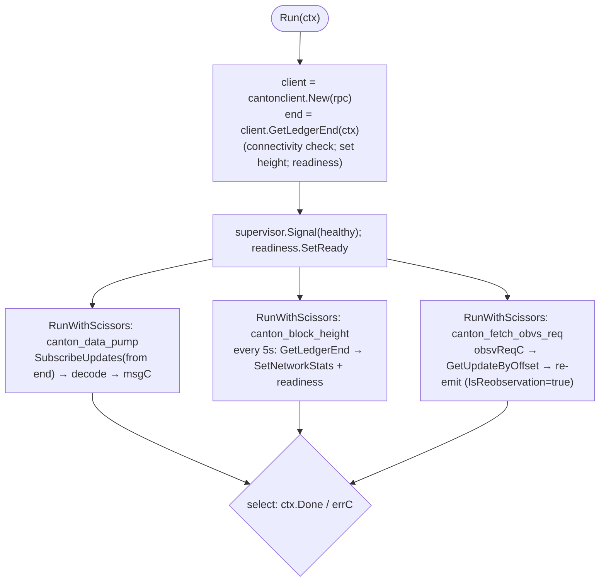

# Wormhole Core Bridge & Watcher for Canton

This directory contains the Wormhole **core bridge** for the
[Canton Network](https://www.canton.network/) (implemented in
[Daml](https://docs.daml.com/)) and documents the guardian-node **watcher** that
observes it (implemented in Go under
[`node/pkg/watchers/canton`](../node/pkg/watchers/canton) with a Ledger-API
client under [`node/pkg/cantonclient`](../node/pkg/cantonclient)).

**Target deployment:** the **public Canton Network mainnet** — Canton **3.5.x**
protocol, **Daml SDK 3.5.1** (Daml-LF **2.3**, Protocol Version **35**). Two
consequences shape the design: Ledger API **v2**, and **contract keys too weak
to build on** (non-unique, resolved against the submitter's read view, negative
lookups fail open) — the package uses **no contract keys**: contracts are
addressed by contract-id, resolved off-ledger (§4.7); identity uniqueness is
registry-enforced and address integrity is cryptographic (see §1, §4).

The goal is parity with the canonical EVM core bridge
([`ethereum/contracts/Implementation.sol`](../ethereum/contracts/Implementation.sol),
[`Messages.sol`](../ethereum/contracts/Messages.sol),
[`Governance.sol`](../ethereum/contracts/Governance.sol)) and conformance with
the Wormhole whitepapers:

- [0001 — Generic Message Passing](../whitepapers/0001_generic_message_passing.md)
- [0002 — Governance Messaging](../whitepapers/0002_governance_messaging.md)
- [0004 — Message Publishing](../whitepapers/0004_message_publishing.md)
- [node watcher README](../node/pkg/watchers/README.md)

> **Status:** initial implementation. The Daml packages **compile and tests pass
> on Daml SDK 3.5.1**, including on-chain VAA verification validated against a
> real guardian-signed VAA and the cross-language address derivation pinned by a
> shared test vector. The remaining mainnet-gating item — the exact Ledger-API
> protobuf surface — plus the deployment/observer topology are tracked in
> [Open Questions & Validation Items](#11-open-questions--validation-items).

---

## 1. Background: how Canton differs from EVM

Wormhole's core bridge has two responsibilities on every chain:

1. **Publish** messages — an on-chain caller emits a message; the guardians
   observe it, reach quorum, and produce a signed VAA.
2. **Verify** messages (VAAs) on-chain — needed so the chain can act on
   governance VAAs (guardian-set upgrades, fees, upgrades) and so higher-level
   protocols (token bridge, etc.) can verify inbound VAAs.

Canton is structurally unlike EVM/Solana/Sui, and those differences drive the
design:

| Concept                   | EVM                                         | Canton                                                                                                                                                 |
| ------------------------- | ------------------------------------------- | ------------------------------------------------------------------------------------------------------------------------------------------------------ |
| Smart-contract model      | Solidity contract with mutable storage      | Daml **templates**; state is the set of **active contracts** (UTXO-like). State is changed by **archiving** a contract and **creating** its successor. |
| Calling a method          | `CALL` to an address                        | **Exercising a choice** on a contract                                                                                                                  |
| Identity / "address"      | 20-byte account/contract address            | **Party ID** (a string `hint::fingerprint`) and **contract IDs**                                                                                       |
| Event log                 | `LOG`/`event` topics                        | Ledger-API **events** (`CreatedEvent`, `ExercisedEvent`) in the transaction stream                                                                     |
| Block / height            | block number                                | **participant offset** (monotone `int64`) into the update stream                                                                                       |
| Finality                  | probabilistic (reorgs) → consistency levels | deterministic: once a transaction is committed by the sequencer/mediator it is final. No reorgs.                                                       |
| Node API the watcher uses | JSON-RPC / `eth_getLogs`                    | **Ledger API v2** (gRPC), `UpdateService` streaming                                                                                                    |
| Crypto available on-chain | `ecrecover`, `keccak256` precompiles        | Daml `keccak256` and `secp256k1` built-ins (see §5)                                                                                                    |

The most consequential differences:

- **No `msg.sender`.** A Daml choice knows its acting parties, but Wormhole
  needs a stable 32-byte emitter address with a per-emitter monotonically
  increasing sequence. We solve this with an **`Emitter` registration**
  contract (§4.2), analogous to Sui's `EmitterCap`. The emitting party (`owner`)
  co-signs the `Emitter` and is part of the address derivation, so it is the
  faithful Canton analog of `msg.sender`: only that party's key can emit under
  its address (§4.2, §10).
- **No `ecrecover`.** Daml's `secp256k1` builtin _verifies_ a signature against
  a _public key_; it does not _recover_ the signer from the signature like
  Ethereum does. Guardian-set state on Canton therefore stores guardian
  **public keys** (not just their 20-byte addresses), bound to the canonical
  addresses from the governance VAA (§5).
- **No global mutable singletons; no contract keys.** The "core bridge
  contract" is modeled as a single long-lived **`CoreState`** contract, archived
  and recreated on every governance transition. Contract keys exist on Canton
  3.5 (Daml-LF 2.3) but are **not unique** — multiple active contracts may share
  a key ([docs](https://docs.canton.network/appdev/modules/m3-contract-keys#contract-keys))
  — and lookups resolve against the submission's readers, with negative results
  failing open (§4.6). They can carry neither uniqueness nor authenticity, so
  this package uses none: contracts are addressed **by contract-id**, resolved
  from a stakeholder's own ACS or via the disclosure service (§4.7), and
  authenticated by their **payloads** (signatories cannot be forged). The
  `CoreState` is **co-signed by the `operator` and a `guardianGovernance`
  party** (a k-of-n threshold party), so the operator cannot forge the guardian
  set (§4.1); per-emitter uniqueness is a **registry** that allocates ids plus
  an owner-bound, cryptographic address (§4.2).

---

## 2. Architecture overview


The watcher is **read-only**: it never submits to Canton. It observes the
`PublishMessage` choice's result event, maps it to a
[`common.MessagePublication`](../node/pkg/common/chainlock.go), and hands it to
the processor exactly like every other watcher.

---

## 3. The VAA and the digest (unchanged across chains)

Canton uses the standard VAA v1 body and digest. Quoting
[0001](../whitepapers/0001_generic_message_passing.md) and matching
`Messages.sol`:

```
body = timestamp(4) ‖ nonce(4) ‖ emitterChain(2) ‖ emitterAddress(32)
       ‖ sequence(8) ‖ consistencyLevel(1) ‖ payload(var)

digest = keccak256( keccak256( body ) )          // double keccak, Ethereum-style
```

Guardians sign `digest` with secp256k1 (Ethereum ECDSA, 65-byte `r‖s‖v`).
Replay protection records `digest` (the double keccak — EVM's `vm.hash`), both
for governance (`consumedGovernance`, §4.4) and for integrator VAAs (the
`ReplayNode` trie, §4.6). The on-chain Daml verifier reconstructs and re-hashes
the body and checks signatures against the stored guardian set (§5).

`ChainID` for Canton is **72** (`ChainIDCanton`), the next free mainnet ID after
Arc (71). It is registered in [`sdk/vaa/structs.go`](../sdk/vaa/structs.go).

---

## 4. On-chain design (Daml)

Daml package name: `wormhole-core` (the `core` package). Module layout under
[`core/daml/`](core/daml):

| Module                      | Responsibility                                              |
| --------------------------- | ----------------------------------------------------------- |
| `Wormhole.Core.Bytes`       | byte/hex helpers, big-endian integer (de)serialization      |
| `Wormhole.Core.VAA`         | VAA struct, parser, digest, signature/quorum verification   |
| `Wormhole.Core.GuardianSet` | guardian-set representation and expiry                      |
| `Wormhole.Core.State`       | the `CoreState` singleton + `EmitterRegistry` and `Emitter` |
| `Wormhole.Core.Governance`  | governance packet parsing and the governance choices        |
| `Wormhole.Core.Setup`       | initialization (`setup`)                                    |

### 4.1 `CoreState` — the singleton

```haskell
template CoreState
  with
    operator           : Party          -- advances the singleton; the "deployer"
    guardianGovernance : Party          -- guardians' governance anchor (threshold party)
    guardianObserver   : Party          -- read-only guardian observer (stakeholder, never signs)
    chainId            : Int            -- 72
    governanceChainId  : Int            -- 1 (Solana)
    governanceContract : Bytes32        -- 0x..0004 (the governance emitter)
    guardianSetIndex   : Int            -- current set index
    guardianSets       : Map Int GuardianSet   -- index -> set (with expiry)
    messageFee         : Int            -- fee required to publish (native units)
    consumedGovernance : Set Bytes32    -- governance-only replay protection (§4.6)
  where
    signatory operator, guardianGovernance
    observer guardianObserver          -- read-only; sees governance transitions
```

**Read-only guardian observer.** `guardianObserver` is a template `observer`
(hence a **stakeholder/informee**, never a signatory or controller) on the
attestation surface — `CoreState` here and `Emitter` in §4.2. The ledger-model
rule that makes this sufficient: **informees of a *consuming* exercise include
the contract's stakeholders**. `SubmitGovernanceVAA` is consuming, so the
observer sees every guardian-set/fee/governance transition and each successor
`CoreState` create; `PublishMessage` is consuming, so it sees the full message
surface (§4.2). Nonconsuming exercises (`ParseAndVerifyVAA`, §4.3) do NOT reach
observers, which is acceptable — that path is a pure read. Adding an observer
requires no authority from that party and changes nothing about who can
create/exercise these contracts, so guardians watch what they attest without
ever entering Canton's confirmation path (§10). The scope is deliberately the
attestation surface only, **never** holdings, balances, or transfer legs.

Every state-mutating choice is `controller`-checked (controller `operator`),
archives the current `CoreState`, and `create`s the next one with updated fields.
This is the Daml idiom for mutable state and gives us deterministic,
replay-protected transitions.

**Singleton co-signed by a governance party; authenticity is in the payload.**
The `CoreState` is co-signed by the `operator` and a **`guardianGovernance`**
party. In production that is a **decentralized-namespace external party**
controlled by a k-of-n threshold of guardian keys — the same construction as
the Canton Network's DSO party — rotated at the topology layer without touching
this template (the party id, and thus every consumer's trust anchor, is stable
across guardian rotation). Two things follow:

- **The operator cannot forge the guardian set.** Because `guardianGovernance`
  is a signatory, a compromised operator cannot `create` a `CoreState` bearing
  the real governance party — so any fetched or disclosed `CoreState` whose
  `guardianGovernance` (or `operator`) field is the known anchor party is
  **authentic by construction**, however its cid was obtained. Consumers
  authenticate the payload, never the resolution path (§4.7). An operator
  puppet could create a `CoreState` under a *different* governance party — but
  its payload names the wrong parties and no consumer trusts it.
- **Governance stays low-friction.** `guardianGovernance` actively signs only at
  **genesis**; each `SubmitGovernanceVAA` transition inherits its authority from
  the archived contract (the same authority-propagation as the `Emitter` owner
  through `PublishMessage`), so the operator submits governance alone. "Exactly
  one live `CoreState`" is still behavioral (operator + governance create one at
  setup), but the set's *contents* are now anchored.

Per-emitter **sequence numbers are stored in each `Emitter`** (§4.2), not in
`CoreState`. This is deliberate: in Canton, a contract's choice can only be
exercised by a stakeholder of that contract, and the emitter owner is _not_ a
stakeholder of the operator-owned `CoreState`. Keeping the sequence in the
`Emitter` (where the owner _is_ a stakeholder) lets the owner publish — and
advance its own sequence — **without the operator's authority**, preserving
EVM's permissionless `publishMessage`. `CoreState` therefore holds only shared
config and governance state.

> **Why an `operator` party?** Canton requires every contract to have a
> signatory. The `operator` is a designated, well-known party (configured at
> deploy time) that owns the singleton. It has **no special authority** over
> message contents or governance outcomes — governance is gated entirely by VAA
> verification (§4.4). Its role is mechanical: it is the party that the daml
> transaction is submitted as in order to advance the singleton. This mirrors
> how non-EVM chains (e.g. Near) have an account that "owns" the bridge object
> without being able to forge messages.

### 4.2 Message publishing

Mirrors `publishMessage(nonce, payload, consistencyLevel)` from
`Implementation.sol:15` and whitepaper 0004.

An integrator first registers an emitter — **directly, with no operator
involvement**. The operator runs an `EmitterRegistry` (created at setup); the
requester exercises `RegisterEmitter` on it, holding only the registry's
disclosure (§4.7). The flexible controller brings the requester's signature;
the operator's co-signature on the created `Emitter` is *inherited* from the
registry's signatory — the same authority-inheritance that powers
`VerifyAndConsumeVAA`. Registration is permissionless (EVM/Sui parity: anyone
may emit); the choice is consuming, so racing registrations contend on the
registry and the loser retries with the fresh cid:

```haskell
-- One per operator; allocates monotonically increasing emitter ids.
template EmitterRegistry with
    operator         : Party
    guardianObserver : Party   -- carried (field only) to thread into new Emitters
    nextId           : Int
  where
    signatory operator
    -- guardianObserver is a FIELD only here, NOT a template observer: guardians
    -- watch the attestation surface, not id allocation (least privilege).
    -- choice RegisterEmitter : (ContractId EmitterRegistry, ContractId Emitter)
    --   with requester : Party
    --   controller requester   -- operator authority inherited; no crank

template Emitter
  with
    operator         : Party
    owner            : Party
    guardianObserver : Party   -- read-only guardian observer (stakeholder, never signs)
    emitterId        : Int      -- registry-allocated
    emitterAddress   : Bytes32  -- keccak256(tag ‖ operator ‖ owner ‖ emitterId), set at creation
    sequence         : Int      -- next sequence to assign (per-emitter)
  where
    signatory operator, owner   -- owner co-signs: the msg.sender analog
    observer guardianObserver   -- read-only; sees PublishMessage (consuming)
```

The `guardianObserver` is threaded in at registration: `RegisterEmitter` sets
the registry's field on the created `Emitter`. Because
`PublishMessage` is consuming, the observer is an informee of every publish
exercise (and its `WormholeMessage` result) plus the sequence-bumped successor
`Emitter` create — the full message surface — with no authority (§4.1, §10).

**Emitter address derivation.** The 32-byte Wormhole emitter address is

```
keccak256( utf8("wormhole:emitter:v1")
         ‖ uint32be(len(registrar)) ‖ utf8(registrar)
         ‖ uint32be(len(owner))     ‖ utf8(owner)
         ‖ uint64be(emitterId) )
```

where `registrar` is the operator. The 4-byte length prefixes make the preimage
injective across the two variable-length party ids. It is computed **on-ledger**
at allocation (Daml `DA.Crypto.Text` is stable in 3.5) and stored in
`emitterAddress` for integrators to read, but the guardian watcher **re-derives**
it from the `WormholeMessage` fields and is the sole source of truth — a corrupt
on-ledger value cannot spoof it.

**Impersonation is cryptographically prevented (the `msg.sender` guarantee).**
Because the `owner` is both a **signatory** of the `Emitter` and part of the
address preimage, only a transaction carrying the owner's authority can create a
contract whose address is the owner's. A compromised `operator` therefore cannot
emit under an existing emitter's address: an operator-alone forge is rejected in
guardian replay (missing the owner's signature), and a colluding duplicate under
a different owner derives a **different**, untrusted address. This is the
invariant guardians verify — "the transaction is Daml-valid under the vetted
package" — with no bespoke watcher logic (see [§10](#10-trust-model--deployment-topology)).
Registry-allocated ids give per-owner uniqueness and let one party hold **many**
emitters, matching Sui's multiple `EmitterCap`s; id-sequence discipline is
operator-behavioral, but address integrity is not.

Publishing — a choice on the **`Emitter`** (controller = `owner`), so it needs
no operator authority:

```haskell
-- on Emitter
choice PublishMessage : WormholeMessage
  with
    nonce            : Int            -- uint32
    payload          : Bytes          -- <= 750 bytes (whitepaper 0004)
    consistencyLevel : Int            -- uint8; see §6
  controller owner
  do
    -- 1. assert payload length <= 750
    -- 2. (fee enforcement deferred; messageFee = 0 in v1)
    -- 3. archive self; create Emitter with sequence = sequence + 1 (SAME key)
    -- 4. return WormholeMessage{registrar, owner, emitterId, sequence, nonce,
    --      payload, consistencyLevel} -- watcher derives the address
    pure result
```

The choice's **exercise result** is the `WormholeMessage`. The sequence-bumped
`Emitter` is recreated with both signatures inherited from the consumed
contract; the owner is a signatory, so the successor's **cid arrives on its own
ACS** as the transaction's `CreatedEvent`, and the next publish addresses that
cid directly — stakeholders never need an off-ledger resolver (§4.7). The
watcher reads the result directly from the `ExercisedEvent.exercise_result` on
the Ledger-API stream (see §7). The `WormholeMessage` record is the wire
contract between Daml and the watcher:

```haskell
data WormholeMessage = WormholeMessage with
    registrar        : Party     -- the operator; address input
    owner            : Party     -- the emitting party; address input (anti-impersonation)
    emitterId        : Int       -- registry-allocated; address input
    sequence         : Int       -- uint64
    nonce            : Int       -- uint32
    consistencyLevel : Int       -- uint8
    payload          : Bytes
  deriving (Eq, Show)
```

Equivalent to the EVM `LogMessagePublished(sender, sequence, nonce, payload,
consistencyLevel)` event (`Implementation.sol:12`), except the `sender` (emitter
address) is **derived by the watcher** from `(registrar, owner, emitterId)`
rather than carried in the record. The VAA **timestamp** is not carried in the
record either: per whitepaper 0001/0004 the guardian derives it from the block,
so the watcher reads it from the transaction's **ledger effective time**
(`Transaction.effective_at`) — see §7.1.

**Sequence numbers** are per-emitter, start at 0, increment by
1 — identical to EVM's `_state.sequences[emitter]`.

**Fees.** Whitepaper 0004 requires a fee in the chain's native token. Fees are
paid via the **Canton Network Token Standard** (CIP-0056, V1 — the
`splice-api-token-*-v1` interface DARs vendored under the `canton/dars/` directory; the old
splice-wallet payment requests are deprecated), so the bridge works with
Canton Coin or any standard token, chosen at genesis
(`CoreState.feeInstrument` — no governance action covers it; migrating
instruments is a genesis-class ceremony):

- **The payer is the submitter**, so the bridge only *consumes* allocations,
  never issues wallet-facing `AllocationRequest`s (future UX work). The payer
  locks funds against the bridge's settlement via the token registry's
  `AllocationFactory` (its wallet/CLI plus the registry's CIP-0056 OpenAPI,
  which supplies the `ExtraArgs` choice context and any registry disclosures
  — the same untrusted-for-safety, liveness-only role as our own disclosure
  service, §4.7), with the bridge convention `executor = sender = payer`,
  `receiver = feeRecipient`.
- The charging choice validates the allocation — receiver, instrument, amount
  (`≥` fee: the **entire leg amount transfers**, allocations are
  all-or-nothing, so overpayment is deliberate padding against fee-raise
  races), sender, and the **instrument admin's signature** (views are
  template-computed and forgeable; a signature is not — authenticate
  payloads, never resolution paths) — then exercises
  `Allocation_ExecuteTransfer` **in the same transaction** as the
  publish/registration/claim. Executing consumes the allocation: one-shot by
  activeness, no replay bookkeeping. Fees are `Int`s in **10^-10 token
  units** (exactly Decimal's last digit — every fee is exactly
  representable).
- `Allocation_ExecuteTransfer` needs sender ∧ receiver ∧ executor authority
  jointly, and the receiver is the fee recipient — so all charging routes
  through `CoreState` choices (`ChargeMessageFee` / `ChargeFee`), where the
  recipient's authority is inherited. `PublishMessage` therefore references
  the `CoreState` on every publish (EVM parity: the current `messageFee` is
  read each call; the cid churns only on governance actions — a stale cid
  fails closed and is re-resolved). Registries charge their own operator-set
  `registrationFee`/`claimFee` through the same choice; at fee 0 they skip
  the `CoreState` entirely.
- **Custody is governance-controlled**: `feeRecipient` is the
  `guardianGovernance` threshold party, so accrued fees move only via the
  k-of-n guardian ceremony — the operator never touches them (the Canton
  analog of "fees sit in the bridge contract"). A `TransferFees` governance
  VAA mints an on-ledger `FeeWithdrawalAuthorization` (signed by
  guardianGovernance, authority inherited from the consumed `CoreState`)
  recording the amount, the VAA's 32-byte recipient, and the VAA hash — the
  artifact the guardians' custody policy matches when threshold-signing the
  actual outbound token transfer. The enforcement of "only per authorization"
  lives in gg key custody, the same trust plane as the guardian keys
  themselves.
- Token Standard **V2** (CIP-0112) is approved but not yet on mainnet; it
  arrives as a parallel `-v2` interface family, and
  `Wormhole.Core.Fees.chargeFee` is the single seam where support would be
  added.

### 4.3 VAA verification choice

```haskell
-- on CoreState; pure verification, does not mutate state
nonconsuming choice ParseAndVerifyVAA : VerifiedVAA
  with
    verifier   : Party            -- any party; the sole controller
    encodedVAA : Bytes
    pubKeys    : [(Int, Bytes)]   -- guardianIndex -> 65-byte uncompressed pubkey
  controller verifier
  do
    vaa <- parseVAA encodedVAA
    verifyVAA self vaa pubKeys     -- §5
    pure (toVerified vaa)
```

`pubKeys` are supplied by the caller because Daml verifies against a public key,
not by recovery (§5). They are _untrusted hints_; verification fails unless each
provided key hashes to the guardian address stored in the set.

**This is genuinely permissionless, not merely operator-delegated.** `verifier`
is the sole controller — `operator` never needs to be an active party. The
choice is `nonconsuming` and does no create/archive at all, so nothing in its
body needs `operator`'s authority for any structural reason (contrast
`SubmitGovernanceVAA` below, which *is* consuming and creates a successor
`CoreState` genuinely needing `guardianGovernance`'s co-signature). Any external
protocol — the token bridge, NTT, anything else — can verify a VAA as itself.
The one real requirement is visibility, not authorization: a non-stakeholder
needs `CoreState` explicitly disclosed to reference it at all, via Daml's
[Explicit Contract
Disclosure](https://docs.digitalasset.com/build/3.4/sdlc-howtos/applications/develop/explicit-contract-disclosure.html)
feature — a data attachment, not a signature — servable by any party with read
access. In Daml Script, `submitWithDisclosures` is the idiom. Proven both
in-memory
(`test/daml/Test/TestCore.daml:testParseAndVerifyVAAByExternalVerifier`) and
against a live sandbox/participant
([`node/pkg/watchers/canton/core_verify_vaa_integration_test.go`](../node/pkg/watchers/canton/core_verify_vaa_integration_test.go)):
a party with no relationship to `CoreState` at all — not `operator`, not
`guardianGovernance` — verifies a real guardian-signed VAA as itself.

Integrators that must consume a VAA (redeem exactly once) use
`VerifyAndConsumeVAA` instead, which verifies **and** records consumption
atomically (§4.6).

### 4.4 Governance

Governance follows [0002](../whitepapers/0002_governance_messaging.md). A single
`SubmitGovernanceVAA` choice on `CoreState` (controller `operator`) verifies the
VAA and dispatches on the parsed action. Module identifier is **`"Core"`**
(`0x00..00436f7265`, 32 bytes). A governance VAA is accepted only if (matching
`Governance.sol:190`):

1. `verifyVAA` passes against the **current** guardian set;
2. `emitterChain == governanceChainId` and `emitterAddress == governanceContract`;
3. `module == "Core"` and `action` matches the choice;
4. `chain == chainId` (or `0` for chain-independent actions);
5. `digest ∉ consumedGovernance` — then it is inserted (replay protection).

Supported actions (parity with `GovernanceStructs.sol`):

| Action                 | ID  | Payload (after 32-byte module + 1-byte action)   | Behavior                                                                                                                                                                                   |
| ---------------------- | --- | ------------------------------------------------ | ------------------------------------------------------------------------------------------------------------------------------------------------------------------------------------------ |
| **ContractUpgrade**    | 1   | `chain(2) ‖ newContract(32)`                     | Records intent + emits an event. On Canton, "upgrade" = a [Daml package upgrade](https://docs.daml.com/upgrade/); `newContract` is interpreted as the new package-id (32 bytes). See note. |
| **GuardianSetUpgrade** | 2   | `chain(2) ‖ newIndex(4) ‖ len(1) ‖ keys(20·len)` | Validates `newIndex == current+1`; sets old set's `expirationTime = effectiveTime + 86400`; stores new set. Requires `pubKeys` hints to bind addresses (§5).                               |
| **SetMessageFee**      | 3   | `chain(2) ‖ fee(32)`                             | Updates `messageFee`.                                                                                                                                                                      |
| **TransferFees**       | 4   | `chain(2) ‖ amount(32) ‖ recipient(32)`          | Moves collected fees to `recipient`. (No-op accounting until CC payments are wired.)                                                                                                       |

`RecoverChainId` (EVM action 5) is **EVM-specific** (it repairs `block.chainid`
after a fork) and has no analog on Canton; it is intentionally omitted.

**ContractUpgrade note:** EVM upgrades swap a proxy implementation. Daml has no
in-place code mutation; upgrading the bridge logic means deploying a new package
version and having the `operator` migrate the `CoreState` to the new package via
Daml's smart-contract upgrade (data-preserving). The governance VAA records the
authorized target package-id on-ledger; the operator's migration is then
gated by that recorded value. This is the faithful Canton analog and is the one
governance action whose mechanism differs most from EVM — see Open Questions.

### 4.5 Guardian-set expiry

Matches EVM (`Setters.sol`): when a new set is installed, the previous set's
`expirationTime` is set to `effectiveTime + 86400` (1 day). `verifyVAA` accepts a
non-current set only while `effectiveTime < expirationTime`. The current set
never expires.

### 4.6 Replay protection for integrators: a trie of consumed digests

Governance replay protection is the `consumedGovernance` set inside `CoreState`
(§4.4) — fine there, because governance actions are rare and already churn the
singleton. App VAAs (token bridge / NTT) must **not** be recorded that way: Daml
values have no structural sharing across contract updates, so an ever-growing
set would be reserialized into every create node (payload size, participant DB
write, and network cost all linear in history), and every integrator's consume
would contend on the one singleton contract.

They also must not be recorded as per-digest keyed contracts (the design this
replaces): Canton LF 2.3 key lookups resolve once, on the submitting
participant, against the submission's readers, and the result is a pinned
input to validation. Confirming participants re-check authorization,
conformance, and the activeness of every contract a transaction _uses_ — but
they do **not** re-run key lookups against their own stores (with non-unique
keys and per-party visibility there is no canonical answer, and local
re-checks would make validation nondeterministic and leak private state). A
_positive_ resolution names a cid that is consistency-checked like any input;
a _negative_ one names nothing and **fails open**. Replay protection is
precisely a negative claim ("this digest was never consumed"), so it cannot be
built on key lookups — this module uses no contract keys at all.

Instead, each consumer's consumed-digest set is a **prefix trie of leaf
contracts** (`Replay.daml`). A node covers a hex `prefix` and stores the set
of digest *suffixes* consumed under it:

```haskell
template ReplayNode
  with
    consumer       : Party    -- integrator scope party; bears the replay risk
    operator       : Party    -- co-signs: no unilateral archive or re-create
    prefix         : Bytes    -- lowercase hex, 0..63 nibbles; "" at the root
    splitThreshold : Int      -- node capacity; children inherit it
    consumed       : Set Bytes  -- suffixes, each (64 − |prefix|) nibbles
  where
    signatory consumer, operator
```

A trie starts as one root (empty prefix, empty set). `ConsumeDigest`
(consuming, controller `consumer`) checks the node covers the digest, rejects
if the suffix is already present, and recreates the node with it inserted.
When the node is at `splitThreshold`, the consume instead **splits** it: all
16 children are created (one per nibble, empty ones included), suffixes
bucketed by their first nibble, which is dropped. Internal nodes are never
stored. **The invariant: a consumer's active nodes partition the digest space
— every digest has exactly one covering node**, so membership in that node is
global consumption truth.

**Why this is sound where keys were not.** "Not consumed" became a positive
statement about one *named* contract: fetch the covering node, check absence,
consume it. Every confirming participant validates the node's activeness — a stale cid
conflicts and aborts; the current covering node provably contains or excludes
the digest. Soundness is **submitter-independent**: any submitter with a
disclosure of the current covering node gets a correct check, and a wrong or
stale node can only fail the transaction, never replay. Where the key design
failed *open* (a lookup that misses waves a replay through), the trie fails
*closed* (an archived subspace has no covering node — nothing verifies).

`VerifyAndConsumeVAA` (nonconsuming, on `CoreState`, flexible controller
`consumer`) takes the covering node's cid, verifies the VAA (§5), binds the
node to the (consumer, operator) pairing, and exercises `ConsumeDigest` with
the digest — verify + consume + act in one transaction.

Properties:

- **Nobody can touch someone else's scope; your own scope is your own
  problem.** Archival alone only bricks (fail-closed); the replay vector is
  node *re-creation*. Nodes are co-signed, so no third party can archive or
  re-create them (splits inherit both signatures from the archived parent —
  the operator is not involved per consume), and roots come only from the
  operator's `ReplayRootRegistry` — a stateless, never-churning anchor whose
  nonconsuming `ClaimReplayRoot` lends the operator's *inherited* signature
  to a consumer-submitted claim (the `RegisterEmitter` pattern: no crank; the
  operator multisig signs nothing after genesis). Claiming a root for a
  consumer requires **that consumer's authority**, so nobody can fork another
  app's replay scope. There is deliberately *no* one-root-per-consumer
  enforcement: maintaining a single trie is the consumer's own responsibility
  (its disclosure service defines which trie its consumes resolve into, and
  detects forks — more than one covering node — for free). This is EVM
  parity: nobody grants replay storage there either; every integrator owns
  its mapping. A consumer minting parallel roots, like a consumer whose key
  is stolen, only harms itself — and a stolen consumer key defeats the app
  more directly anyway. (If key-compromise resilience is ever wanted, the
  hardening is trie-identity pinning: thread the original root's cid through
  successors via `self` and pin it in the app contract — documented, not
  built.) Spam claims cost the spammer synchronizer traffic per transaction
  and the operator ~300 B of storage per worthless root; no shared contract
  grows, nothing bricks.
- **Scoping and contention.** Tries are per consumer party: different apps
  consume the same VAA independently. Consumes racing on the *same node*
  conflict — exactly one commits (validator-checked, regardless of submitter);
  the loser re-resolves the covering node and retries. A blind retry of a
  consume that actually committed fails on membership ("digest already
  consumed") — a clean idempotency signal. Until the first split, all of one
  app's
  consumes serialize through its root; 16-way fan-out begins at
  `splitThreshold` consumes.
- **Cost.** `defaultSplitThreshold = 128`: suffixes are ≤64-char hex (~66 B
  serialized), so nodes top out ~8.5 KB, the average consume rewrites ~4 KB,
  and the split transaction redistributes the same bytes across 16 creates
  (~15 KB) — all far below Canton's request caps. Total ACS bytes stay ~66 B
  per digest; 10 M digests ≈ 150 k nodes at depth 3–4. Larger thresholds thin
  the ACS but amplify every write.
- **Privacy.** Nodes are integrator-private safety state — deliberately NOT
  observed by `guardianObserver` (§4.1): guardians never re-check target-chain
  consumption, and the attestation surface does not include app redemptions.

**The disclosure service.** Submitters locate the covering node off-ledger: a
service indexes the consumer's active nodes by prefix (following the
`CreatedEvent`s that consumes and splits produce) and serves, for a digest,
the covering node's cid plus its explicit disclosure — alongside the
`CoreState` disclosure it already serves (§4.3). It is **untrusted for
safety**: the worst it can do is serve a wrong or stale node, which fails the
transaction. It is trusted for *liveness* only, like any RPC endpoint. §4.7
aggregates every resolution the service must provide. (Go implementation is
future work; the Daml tests simulate it with a script helper,
`Test.TestReplay.coveringNode`, which also asserts the partition invariant on
every use.)

**Integrating — direct and user-submitted.** The executable reference is
[`test/daml/Test/ExampleIntegrator.daml`](test/daml/Test/ExampleIntegrator.daml)
(test package only): the end user herself exercises `Redeem` on the app
contract with two disclosures attached (CoreState + covering node) and nothing
else — no read grants, no `readAs`, no relayer queue. The manager's
*authority* for the consume is inherited from the app contract's signatory;
its *visibility* is simply not needed. `testIntegratorRedeem` pins the
inversion of the key-based design's failure mode: replay attempts by arbitrary
submitters fail on activeness (stale node) or membership (fresh node) — never
succeed.

### 4.7 Addressing without keys: the disclosure service

With contract keys gone (§1), every contract reference is a **contract-id**.
Two distinct needs hide behind "how do I find the contract", and they have
different answers:

- **Cid resolution** — *what is the current cid of X?* Stakeholders get this
  for free: a consuming exercise delivers the successor's `CreatedEvent` to
  every stakeholder's ACS, so the operator tracks its registries and the
  `CoreState`, an emitter owner tracks its `Emitter`, a consumer tracks its
  trie — all without any off-ledger help.
- **Disclosure attachment** — a **non-stakeholder** submitter must additionally
  attach the explicit-disclosure blob of every contract its transaction
  references, or its participant cannot construct the transaction at all.

The **disclosure service** is the single off-ledger component that provides
both to parties that need them: an index over the relevant contracts — fed by
the Ledger API update stream / ACS of a party that sees them — answering
"current cid (+ disclosure blob) for X". The complete inventory of resolutions
it must serve:

| Contract                | Index                              | Needed by                                                     | Disclosure attachment?                          | Churn                        |
| ----------------------- | ---------------------------------- | ------------------------------------------------------------- | ----------------------------------------------- | ---------------------------- |
| `CoreState`             | the one true instance              | §4.3 verify, §4.6 consume, and EVERY publish / fee'd onboarding (§4.2) | yes — every non-stakeholder submitter (incl. all publishers) | per governance action (rare) |
| `ReplayNode`            | (consumer, prefix covering digest) | every `VerifyAndConsumeVAA` / integrator redeem                | yes for non-stakeholders (e.g. end users); the consumer itself only needs the cid | every consume under that node |
| `EmitterRegistry`       | operator                           | `RegisterEmitter`                                              | yes — the requester submits                     | per emitter registration; recreated on operator fee change |
| `ReplayRootRegistry`    | operator                           | `ClaimReplayRoot`                                              | yes — the consumer submits (cacheable blob)     | only on operator fee change  |
| `Emitter`               | (operator, owner, emitterId)       | `PublishMessage`                                               | no — owner submits, own ACS (but see `CoreState` row) | per publish                  |
| token-registry context  | the fee instrument's registry      | any fee'd choice (§4.2): `ExtraArgs` + registry disclosures    | yes — from the REGISTRY'S own CIP-0056 OpenAPI, not this service | registry-defined             |
| app contracts (e.g. `ExampleIntegrator`) | app-defined      | the app's own choices                                          | app's concern (its users are observers)         | app-defined                  |

Two properties make this safe to outsource:

- **Untrusted for safety.** A wrong or stale answer can only make the
  transaction fail — the trie fails closed on staleness (§4.6), and consumers
  authenticate every resolved contract by its **payload**, never by how the
  cid was found: `CoreState` by its signatory anchor fields (§4.1),
  `ReplayNode` by the (consumer, operator) binding inside `VerifyAndConsumeVAA`
  plus the app-side operator pin (see `ExampleIntegrator.Redeem`). The service
  is trusted for *liveness* only, like any RPC endpoint.
- **One reader suffices.** A service reading as the operator (a stakeholder of
  `CoreState`, both registries, and — as co-signatory — every consumer's trie)
  can serve the whole table; integrators can equally run their own for their
  trie and app contracts. Reading as a party requires only that party's
  `CanReadAs` on the serving participant.

Concrete implementation (interface: `(template, index) → (cid,
created_event_blob)` over the state-service ACS plus the update stream) is
future work; the Daml tests simulate it with `Test.TestReplay.coveringNode` /
`queryDisclosure`.

---

## 5. On-chain signature verification (the crux)

EVM uses `ecrecover(digest, v, r, s)` and compares the recovered 20-byte address
to `guardianSet.keys[i]`. Daml's
[`DA.Crypto.Text`](https://docs.canton.network/appdev/reference/daml-standard-library/da-crypto-text)
has **no recovery** builtin; the relevant functions (confirmed against the
3.x docs) are:

```haskell
keccak256             : BytesHex -> BytesHex
secp256k1             : SignatureHex -> BytesHex -> PublicKeyHex -> Bool  -- SHA-256s the message first
secp256k1WithEcdsaOnly : SignatureHex -> BytesHex -> PublicKeyHex -> Bool  -- verifies the message directly
```

We use **`secp256k1WithEcdsaOnly`** because Ethereum signs the 32-byte
`keccak256(keccak256(body))` digest _directly_ (no further hashing); plain
`secp256k1` would SHA-256 the digest first and never match. The design:

1. **Bind a caller-supplied pubkey → guardian address.** There is no recovery,
   so the verifier is given `pubKeys : [(Int, Bytes)]` (the signing guardians'
   uncompressed keys) and asserts `keccak256(pubKey)[12..32] == keys[index]`.
   Because the address is the keccak of the key, a wrong key can't pass — this
   re-introduces the EVM guarantee without recovery.

2. **DER-encode for the builtin.** `secp256k1WithEcdsaOnly` wants a **DER**
   signature and a **DER (SubjectPublicKeyInfo)** public key, both hex.
   `Wormhole.Core.VAA` DER-encodes the VAA's raw `(r, s)` (`derSignature`) and
   wraps the uncompressed point in the fixed secp256k1 SPKI prefix
   (`derPublicKey`). The 32-byte digest is passed as the message **as-is**.

3. **Verify.** `secp256k1WithEcdsaOnly (derSignature r s) digest (derPublicKey pubKey)`.

4. **Quorum** — identical to EVM `Messages.sol:90`:
   `required = floor(numGuardians * 2 / 3) + 1`. Signatures must be in
   **strictly ascending** guardian-index order (prevents double-counting).

### Making verification hint-free for integrators (recommended)

Supplying `pubKeys` on every call is acceptable for governance (rare,
operator-submitted) but is real friction for integrators (e.g. a token bridge),
whose relayers would otherwise have to look up the signing guardians' keys on
every inbound message. The recommended evolution: **persist the guardian public
keys in the guardian set** — i.e. `GuardianSet` stores `pubKeys` alongside `keys`,
bound to the canonical addresses _once_ at install time (the
GuardianSetUpgrade / setup choices already receive pubkey hints and verify
`keccak256(pubKey)[12..32] == addr`, so the binding is free). After that,
`verifyVAA` reads the keys from the set and callers pass **only the VAA bytes**,
making the integrator API equivalent to EVM's `parseAndVerifyVM(bytes)`. This is
a planned change to the current code, which still takes per-call hints.

### Validation status

The whole verification path is **empirically validated** against a real
Ethereum-style guardian signature on Daml SDK 3.5.1. `testParseAndVerifyVAA` and
`testGovernanceSetMessageFee` (in [`TestCore.daml`](test/daml/Test/TestCore.daml))
feed a genuine VAA — signed by the well-known devnet guardian and produced by
[`node/pkg/cantonclient/vectorgen_test.go`](../node/pkg/cantonclient/vectorgen_test.go)
— through `ParseAndVerifyVAA` / `SubmitGovernanceVAA` and both pass. That confirms:

- ✅ `keccak256` hashes the **decoded** hex bytes (the double-keccak digest
  matched the signature), so the `BytesHex` semantics are as assumed;
- ✅ `derSignature` (DER `r,s`) and `derPublicKey` (SPKI) are encoded correctly;
- ✅ `secp256k1WithEcdsaOnly` verifies the 32-byte digest **directly** (no
  pre-hash), and the pubkey→address keccak binding holds.

As of Daml SDK 3.5 the `DA.Crypto.Text` builtins are **stable** (the earlier
Alpha `-Wno-crypto-text-is-alpha` suppression is no longer needed), so the
previous mainnet-readiness concern about depending on an Alpha builtin is
resolved. All Daml crypto remains encapsulated in `Wormhole.Core.VAA`, and the
same builtins now also back the on-ledger address derivation in
`Wormhole.Core.Bytes` (`toHex` + `keccak256`).

---

## 6. Consistency / finality

Canton transactions are final once committed by the synchronizer
(sequencer + mediator); there are no reorgs. Like Sui, Canton therefore has a
single meaningful consistency level. The watcher treats every observed message
as final and publishes immediately. The `consistencyLevel` byte is passed
through from the `WormholeMessage` (integrators may set it; per
[0001](../whitepapers/0001_generic_message_passing.md) "all other chains … this
field will be `0`"), and the watcher does **not** gate on it.

---

## 7. Off-chain design (the watcher)

Lives in [`node/pkg/watchers/canton`](../node/pkg/watchers/canton); the gRPC
client is [`node/pkg/cantonclient`](../node/pkg/cantonclient). It mirrors the
structure of the Sui watcher
([`node/pkg/watchers/sui`](../node/pkg/watchers/sui)) and the `suiclient`
package.

### 7.1 `cantonclient` (Ledger API v2, gRPC)

There is no official Go binding for the Daml Ledger API, so the
`com.daml.ledger.api.v2` protobuf (the State + Update service closure, from
**Canton 3.5.5**) are vendored under
[`node/pkg/cantonclient/proto`](../node/pkg/cantonclient/proto) and compiled with
the repo's `buf` toolchain; the generated stubs are committed and CI-verified
(see [`node/pkg/cantonclient/README.md`](../node/pkg/cantonclient/README.md)).
The client exposes a small interface (mirroring `suiclient.SuiClient`):

```go
type CantonClient interface {
    // GetLedgerEnd returns the current participant offset (the "height").
    GetLedgerEnd(ctx context.Context) (int64, error)

    // SubscribeUpdates streams transactions from beginExclusive onward,
    // delivering each Wormhole message-publish event found in them.
    SubscribeUpdates(ctx context.Context, beginExclusive int64, templateID TemplateID, choiceName string, out chan<- CantonMessageEvent) (Subscription, error)

    // GetUpdateByOffset fetches a single transaction by offset (reobservation).
    GetUpdateByOffset(ctx context.Context, offset int64) (CantonTransaction, error)

    Close() error
}
```

Mapping to Ledger API v2 RPCs:

| Need                | Ledger API v2                                                                                                                       |
| ------------------- | ----------------------------------------------------------------------------------------------------------------------------------- |
| height / readiness  | `StateService.GetLedgerEnd` → `offset (int64)`                                                                                      |
| live message stream | `UpdateService.GetUpdates` (server stream); filter `Transaction.events[].exercised` by `template_id` + `choice == "PublishMessage"` |
| reobservation       | `UpdateService.GetUpdateByOffset` (or `GetTransactionByOffset`) for the offset encoded in the reobservation request                 |

The Wormhole message comes from the **`ExercisedEvent`** of the `PublishMessage`
choice: `exercise_result` is the `WormholeMessage` record (§4.2), decoded from
the Ledger-API `Value`/`Record` representation. The watcher derives the 32-byte
emitter address from the record's `registrar`, `owner`, and `emitterId` fields
using the canonical encoding in §4.2 (see `deriveEmitterAddress` in
[`watcher.go`](../node/pkg/watchers/canton/watcher.go)); the encoding is pinned
against the Daml side by a shared cross-language test vector.

**Party filter.** The `GetUpdates` request uses an `UpdateFormat` with a wildcard
template filter under **`filters_for_any_party`** by default — the watcher
observes `PublishMessage` from _every_ emitter on the participant and needs no
operator party id. For **production guardians**, set `--cantonReadAsParty` to the
read-only **`guardianObserver`** party (§4.1): it is a stakeholder of the
`Emitter`/`CoreState` attestation surface, so the narrowed `filters_by_party`
stream still carries every `PublishMessage`, and it makes the trust boundary
explicit. If the guardian participant hosts only `guardianObserver` the wildcard
default is equivalent, so the flag is precision / defense-in-depth. The **devnet**
sandbox is a single participant, so it keeps the wildcard default.
`TRANSACTION_SHAPE_LEDGER_EFFECTS` is required so `ExercisedEvent`s — which carry
the choice result — are included.

### 7.2 `TxID` and offsets

The Ledger API has no 32-byte transaction hash. We use the **participant offset**
(`int64`) as the canonical transaction identifier:

- `MessagePublication.TxID` = the transaction's offset, big-endian, left-padded
  to 32 bytes (so it round-trips through the 32-byte `tx_hash` reobservation
  field).
- Reobservation decodes those 32 bytes back to an `int64` offset and calls
  `GetUpdateByOffset`.

The Daml `update_id` (a string) is carried in logs for human correlation but is
not the `TxID`, because reobservation plumbing (`gossipv1.ObservationRequest`)
uses raw bytes and offsets are the stable, range-queryable key.

### 7.3 `Run` loop (three goroutines, mirrors Sui)



Each observed event becomes a `common.MessagePublication`
([`chainlock.go`](../node/pkg/common/chainlock.go)) with
`EmitterChain = vaa.ChainIDCanton`, `EmitterAddress = deriveEmitterAddress(registrar, owner, emitterId)`,
`Unreliable = false`, then is sent on `msgC`.

### 7.4 Configuration

`WatcherConfig` (implements `watchers.WatcherConfig`):

```go
type WatcherConfig struct {
    NetworkID   watchers.NetworkID
    ChainID     vaa.ChainID        // ChainIDCanton
    Rpc         string             // host:port of the Ledger API
    PackageID   string             // package-id of wormhole-core (template filter)
    ReadAsParty string             // optional; production guardians set the guardianObserver party
}
```

Wired into the guardian via
[`node/pkg/node/options.go`](../node/pkg/node/options.go) and a `--cantonRPC` /
`--cantonContract` flag pair in `node/cmd/guardiand`, following the Sui pattern.
`--cantonReadAsParty` populates `ReadAsParty`; production guardians set it to the
read-only `guardianObserver` party (§4.1, §7.1), and devnet leaves it empty
(wildcard).

---

## 8. File map

```
canton/
  README.md                      ← this document
  multi-package.yaml             ← multi-package project (core + test)
  Dockerfile                     ← devnet image (build DARs + run sandbox)
  core/                          ← `wormhole-core` package (templates; NO daml-script)
    daml.yaml
    daml/Wormhole/Core/Bytes.daml
    daml/Wormhole/Core/VAA.daml
    daml/Wormhole/Core/GuardianSet.daml
    daml/Wormhole/Core/State.daml
    daml/Wormhole/Core/Replay.daml
    daml/Wormhole/Core/Fees.daml ← CIP-0056 fee collection (chargeFee, §4.2)
    daml/Wormhole/Core/Governance.daml
    daml/Wormhole/Core/Setup.daml
  dars/                          ← vendored token-standard interface DARs (provenance in dars/README.md)
  test/                          ← `wormhole-core-test` package (Daml Scripts)
    daml.yaml                    ← data-dependency on core's DAR + the interface DARs
    daml/Test/TestCore.daml      ← unit tests + devnet `setup` / `integrationPublish`
    daml/Test/TestGuardianObserver.daml ← read-only guardianObserver visibility/authority tests
    daml/Test/TestReplay.daml    ← replay-trie tests + disclosure-service simulation (§4.6)
    daml/Test/MockToken.daml     ← minimal CIP-0056 mock instrument for fee tests
    daml/Test/TestFees.daml      ← fee-payment tests (§4.2)
    daml/Test/ExampleIntegrator.daml ← reference integrator + disclosure/replay e2e (§4.6)
  devnet/
    start_sandbox.sh             ← starts the Ledger API v2 sandbox
    bootstrap.sh                 ← allocates Operator + creates CoreState
    wait_for_ledger.sh

node/pkg/cantonclient/           ← Ledger API v2 gRPC client
  proto/com/daml/ledger/api/v2/  ← real vendored protos (Canton 3.5.5)
  proto/gen/                     ← generated Go stubs (buf generate)
  vectorgen_test.go              ← regenerates the signed-VAA test vector (GEN_CANTON_VECTORS=1)
node/pkg/watchers/canton/        ← the watcher (config.go, watcher.go)
  watcher_integration_test.go    ← dpm-driven end-to-end test (integration tag)
  core_verify_vaa_integration_test.go ← ParseAndVerifyVAA by a non-stakeholder external party (integration tag)
sdk/vaa/structs.go               ← ChainIDCanton = 72
devnet/canton-devnet.yaml        ← Tilt k8s manifest (sandbox + bootstrap)
Tiltfile                         ← `canton` component (opt-in)
```

## 9. Local development

This project uses the Canton Network
[`dpm`](https://docs.canton.network/sdks-tools/cli-tools/dpm) toolchain (not the
legacy `daml` assistant). It is a **multi-package** project
([`multi-package.yaml`](multi-package.yaml)): `core` (the production
`wormhole-core` templates — no `daml-script`) and `test` (`wormhole-core-test`,
the Daml Scripts, with a data-dependency on core's DAR). Splitting keeps
`daml-script` and the test code out of the production DAR.

### Building & testing with `dpm`

```bash
# one-time: install the dpm CLI
curl https://get.digitalasset.com/install/install.sh | sh

cd canton
dpm install 3.5.1                # fetch the pinned SDK (Daml-LF 2.3)
dpm build --all                  # builds core, then test → *.daml/dist/*.dar
cd test && dpm test --all --show-coverage   # run the Scripts + coverage
```

`dpm test` runs every `Script` in
[`TestCore.daml`](test/daml/Test/TestCore.daml) on an in-memory ledger — no
running sandbox required. The suite passes, including governance and VAA
verification with a **real guardian-signed VAA** test vector (§5) and the
owner-bound emitter address derivation pinned against the shared cross-language
vector (`testAddressVector`). Note Daml coverage is **template/choice coverage
only**; the pure parser / DER / governance
helpers and the address encoding are additionally validated by Script
_assertions_ and the signed-VAA / address vectors, not by the coverage metric.

### Watcher integration test (dpm + Go)

The watcher's real transport is covered end-to-end by a Go integration test,
[`node/pkg/watchers/canton/watcher_integration_test.go`](../node/pkg/watchers/canton/watcher_integration_test.go)
(`//go:build integration`):

```
go test -tags integration -run TestCantonWatcherIntegration ./pkg/watchers/canton -v
```

It builds the DAR, boots a `dpm sandbox`, publishes a message via
`dpm script --upload-dar`, then connects the **real** `cantonclient` gRPC client
(real Ledger API v2 protos) and asserts the published `WormholeMessage` is
observed and mapped to a `common.MessagePublication`. It is skipped unless `dpm`
(+ a JDK) is present and is excluded from the default build. Notes learned the
hard way and baked into the test/devnet scripts: Canton's `sandbox` binds the
Ledger API on **6865** and does not take `--dar`/`--port`; and `dpm script` needs
**`--upload-dar`** so package vetting is synchronous (a bare upload races vetting
→ `PACKAGE_SELECTION_FAILED`).

### End-to-end with Tilt

Canton is wired into [`Tiltfile`](../Tiltfile) as an **opt-in** component
(`--canton`), mirroring the Sui setup:

```
tilt up -- --canton
```

This brings up:

- a **`canton`** pod running a Canton **sandbox** (Ledger API v2 on `:6865`)
  ([`devnet/start_sandbox.sh`](devnet/start_sandbox.sh));
- a **`canton-contracts`** bootstrap step that uploads+vets the `wormhole-core`
  DAR (`dpm script --upload-dar`), allocates the **Operator** party, and creates
  the `CoreState` with the standard devnet guardian via `Test.TestCore:setup`
  ([`devnet/bootstrap.sh`](devnet/bootstrap.sh)); and
- the **guardian** configured with `--cantonRPC canton:6865` (no
  `--cantonReadAsParty`: the watcher uses a wildcard "any party" filter, §7.1).

### `guardianGovernance` external-party bootstrap

[`devnet/setup_guardian_governance.sh`](devnet/setup_guardian_governance.sh) +
[`devnet/guardian_governance.canton`](devnet/guardian_governance.canton) stand up
`guardianGovernance` as an **external, decentralized-namespace party** — a
namespace owned by three guardian keys with a 2-of-3 threshold, the same pattern
the Canton Network DSO party uses (§10, §11 item 2). Concretely, the console
script:

1. self-signs a root `NamespaceDelegation` for each of the three owner keys;
2. creates a `DecentralizedNamespaceDefinition` (2-of-3 threshold) over those
   three owner namespaces, authorized by all three;
3. allocates `guardianGovernance::<namespace>` under it and hosts it at
   **Confirmation** permission, with the same three keys registered as its
   threshold transaction-signing keys (`PartyToParticipant.partySigningKeys` —
   the standalone `PartyToKeyMapping` was deprecated in Canton 3.4 in favor of
   this); and
4. writes an artifacts JSON (party id, decentralized-namespace id, owner
   fingerprints/public-key paths, threshold) that is the handoff to submitting
   the same topology to the CN global synchronizer later.

Every topology transaction is built **unsigned**
(`topology.transactions.generate`), signed by each owner's external signer, and
only then submitted (`topology.transactions.load`) — the participant never holds
an owner's private key, matching real guardian custody (HSM/KMS/offline signer).
`devnet/guardian_key_tool.js` is a small Ed25519 keypair/signing helper (Node's
built-in `crypto` module only, no dependencies) that stands in for that custody
system locally; production wires `GG_OWNER_SIGN_CMD_1/2/3` to the real one
instead (see the script's header for the full environment-variable contract).

[`devnet/genesis_guardian_governance.sh`](devnet/genesis_guardian_governance.sh)
exercises the resulting party: it prepares a `create CoreState` command
co-signed by an external `operator` party and `guardianGovernance` (the
interactive-submission equivalent of `Test.TestCore:setup`'s
`submit (actAs operator <> actAs guardianGovernance)`), has owners sign the
prepared
transaction hash, and executes. It supports three modes — `happy` (2-of-3,
succeeds), `threshold` (1-of-3, rejected), and `forge` (no guardianGovernance
signature at all, rejected — the anti-forgery property from §10: a compromised
operator cannot fabricate a `CoreState` bearing the real governance party).

[`devnet/test_guardian_governance.sh`](devnet/test_guardian_governance.sh) runs
all of the above against a fresh `dpm sandbox` and asserts the full table:
namespace/threshold/hosting shape, and all three genesis modes' expected
outcome.

```bash
canton/devnet/test_guardian_governance.sh
```

**Sandbox vs. CN fidelity.** The sandbox has no SVs or decentralized
synchronizer, so "registering with the super-validators" cannot be exercised
locally. That step is theoretical here by construction, not by omission: the
decentralized namespace is guardian-owned, so SVs never approve it — CN
"registration" is just (a) onboarding a participant to the CN global
synchronizer (one-time, SV-sponsored validator onboarding) and (b) submitting
the *same* topology transactions this script builds to that synchronizer instead
of the sandbox's, where they are sequenced and seen by all participants. The
script is synchronizer-target-parameterized (`GG_SYNCHRONIZER_ALIAS`,
`GG_CANTON_CONSOLE_CONFIG`) for exactly that reason, and the local run proves
the namespace/party/threshold mechanics port unchanged.

**Current limitation.** Party hosting is single-participant only
(`HostingParticipant(participant.id, Confirmation)` for the one console-bound
participant) — the sandbox has only one participant to host on, so
multi-participant Confirmation hosting (the production censorship-resistance
requirement) is not exercised locally. Extending the `Seq[HostingParticipant]`
built in `guardian_governance.canton` to additional participant ids is
mechanical; each additional participant's consent-to-host signature follows the
same `transactions.sign(..., signedBy = Seq(<that participant's fingerprint>))`
pattern already used for the first one.

### Status: opt-in while the k8s devnet path is validated

Unlike Sui, the `canton` component is **not** enabled by `--ci`. The guardian
builds the real client by default (no build tag) and the watcher needs no
operator party id (wildcard filter), so there are no functional gates left — the
main item to finish is:

1. **Full k8s path validation.** Validated locally: the Go integration test (§9)
   covers the watcher↔ledger path; the sandbox `0.0.0.0` bind
   (`-C canton.participants.sandbox.ledger-api.address=0.0.0.0` → binds `*:6865`),
   the bootstrap `dpm script --upload-dar` flow, and the same-pod localhost wiring
   are all confirmed against a live `dpm sandbox`. What still needs a real cluster
   run: the `canton-node` **image build** (`canton/Dockerfile`, which fetches dpm
   and builds the DARs) and the **guardian connecting** to `canton:6865` across the
   k8s Service.

Today `--canton` stands up the **chain + contracts** for Daml-side development
(iterating on the templates, `dpm test`); the watcher↔ledger path itself is
covered by the integration test in §9.

---

## 10. Trust model & deployment topology

How does a set of `n` guardians (`k`-of-`n` threshold) run Wormhole on Canton
faithfully — see and attest only what actually happened under rules they accept —
given Canton has no global VM that every node re-executes? Two requirements, met
by two mechanisms:

- **"The code is what we published."** Daml code identity is content-addressed: a
  DAR's **package-id is the hash of the compiled package**, and every Ledger-API
  event carries it (the watcher already filters on `WatcherConfig.PackageID`).
  Publish source + a reproducible build, and each guardian's participant **vets**
  that exact package-id before its parties transact under it. A lookalike package
  simply does not match the filter.
- **"The events are real."** Canton's synchronizer (sequencer + mediator)
  **orders and tallies but never runs Daml**. Execution integrity comes from the
  **participant nodes hosting a transaction's stakeholders re-executing** the
  choice from the vetted DAR and confirming the result; a transaction commits only
  if the confirmation policy over those participants is met.

**Topology.** Each guardian runs a **participant node**, and the read-only
**`guardianObserver`** party (§4.1) is **hosted on every guardian participant at
`Observation` permission** in the `PartyToParticipant` topology mapping. Being a
template `observer` on `Emitter`/`CoreState`, it is an informee of every
`PublishMessage` and `SubmitGovernanceVAA` exercise, so each guardian's
participant independently receives and validates every attestation-bearing
transaction, and an invalid one never appears on that participant's Ledger API —
so a watcher cannot sign it. This is deliberately scoped to the **attestation
surface only** (§4.1, §4.2): the observer is *not* a stakeholder of
`EmitterRegistry` allocations, replay tries, or any holding/balance/transfer
state of other packages — least privilege, in contrast to replica-hosting the
`operator` (whose projection is its entire signatory footprint; kept as a
fallback below). A single shared `guardianObserver` covers all guardians (one
mapping listing every guardian participant), not one party per guardian.

Guardians are **not** given confirmation rights, by two independent properties:
(1) under Canton's confirmation policy the confirming parties of a node are its
signatories/actors — a plain observer party is an informee, never a confirming
party; and (2) even for a confirming party, a participant hosting it at
`Observation` permission does not submit confirmations. So guardian participant
downtime never blocks a Canton transaction; it only delays that guardian's own
observation (fail-safe: it stops signing). This is the point — the VAA quorum is
already the attestation layer, and Wormhole's job is to *refuse to attest*
forgeries, not to halt Canton (giving guardians confirmation duty would duplicate
the quorum and turn guardian downtime into a chain-halt).

> **Fallback (interim, no template change):** where a participant cannot yet host
> the dedicated party, replica-host the `operator` at `Observation` instead. It
> works with zero Daml change but gives a coarser scope (the operator's full
> projection, including registries and replay tries) and couples guardian read
> access to the operator party and its namespace key. Prefer the dedicated
> `guardianObserver`; use operator replica-hosting only as a migration stopgap.

Note the operator party's ACTIVE signing surface after genesis is empty: every
day-to-day flow (`RegisterEmitter`, `ClaimReplayRoot`, fee charging, splits,
governance transitions) reaches its signature by inheritance from contracts it
signed at setup. If the operator is stood up as a k-of-n external threshold
party (the §9 machinery, `GG_THRESHOLD=k`), the interactive-submission signing
ceremony is needed for genesis only. The `guardianGovernance` party's
post-genesis surface grew with fees (§4.2): it holds **fee custody** (accrued
fees sit in its token holdings; withdrawing them is a threshold ceremony
matched against on-ledger `FeeWithdrawalAuthorization`s), and — because every
publish reads the fee off the `CoreState` — its participant is an informee of
every publish, a deliberate throughput/liveness trade recorded in Open
Questions.

**What a compromised operator can and cannot do.** It can degrade **liveness**
(stop serving disclosures, evict observers — all fail-safe: transactions stop
constructing, guardians simply stop seeing and stop signing). It **cannot** produce
anything guardians would wrongly attest: emitting under an existing address
requires that owner's signature (§4.2), so an outbound forge is either an invalid
transaction (rejected in replay, never observed) or a valid contract with a
different, untrusted address.

Crucially, it also **cannot forge the guardian set** used for inbound
verification: `CoreState` is co-signed by the `guardianGovernance` threshold party
(§4.1), so the operator can neither mutate the real `CoreState` nor fabricate
one whose payload names the governance anchor consumers trust. This closes
the one gap that observation-only hosting does *not* cover — inbound state
integrity — by moving it from "trust the single operator" to "trust the k-of-n
governance party." Compromising *that* is a threshold compromise, i.e. genuinely
takeover-class, rather than a single-key bar. Residual inbound corruption (bugs in
a verification path, not forged state) can still only damage Canton-local state —
the same position Wormhole holds on every chain, where a compromised chain wrecks
its own state but cannot forge messages other chains accept. The guardians'
faithfulness invariant thus reduces to **"the transaction is Daml-valid under the
vetted package."**

The observer-party mechanism is now implemented: a dedicated read-only
`guardianObserver` named as a template `observer` on `Emitter`/`CoreState`
(§4.1, §4.2). The residual operational item is **namespace-key custody** — which
key owns the `guardianObserver` party (operator-ops vs a guardian-ops key), since
that key controls the hosting mapping and can therefore evict guardians from
observation. Eviction is fail-safe (guardians stop seeing → stop signing, the same
liveness posture as a compromised operator above), but the custody choice needs a
human decision; see Open Questions.

---

## 11. Open Questions & Validation Items

1. **Ledger API v2 RPC surface.** The exact message/field names of
   `UpdateService.GetUpdates` / `GetUpdateByOffset` / `StateService.GetLedgerEnd`
   shift slightly across Canton releases (e.g. `begin_exclusive`/`end_inclusive`,
   `Update` one-of members). The vendored proto subset targets a specific release
   — confirm and pin against Daml SDK 3.5.1 / Canton 3.5.x.
2. **`guardianGovernance` threshold party.** `CoreState` is co-signed by a
   `guardianGovernance` party (§4.1), so guardian-set integrity is anchored to
   it rather than the operator. §9's `guardianGovernance` external-party bootstrap
   stands it up as a decentralized-namespace external party governed by a 2-of-3
   threshold of guardian keys (DSO-style), and its genesis co-sign ceremony is
   confirmed locally (2-of-3 succeeds, 1-of-3 and no-signature are rejected).
   Remaining before production: the CN-synchronizer submission itself (only
   designed/parameterized here, not exercised — no CN localnet available), the
   topology-level rotation flow (add/remove guardian keys without touching
   `CoreState` — the decentralized namespace's own threshold governs this once
   created, but rotation itself is untested), multi-participant Confirmation
   hosting, and confirming consumers are configured with the correct anchor party
   id. Note the `CoreState` singleton count ("exactly one") is still behavioral —
   confirm the genesis automation creates exactly one. (Emitter/manager
   **address** integrity is separately owner-bound and owner-co-signed, §4.2.)
3. **Guardian observer topology.** *Mechanism resolved:* the dedicated read-only
   `guardianObserver` party is implemented as a template `observer` on
   `Emitter`/`CoreState` (§4.1, §4.2, §10), and `--cantonReadAsParty` maps to it
   for production guardians (§7.1). This observer party is distinct from the
   `guardianGovernance` signatory party (item 2): the observer is read-only, the
   governance party has signatory power. **Residual (needs a human decision):**
   the production `PartyToParticipant` runbook (host at `Observation` permission;
   host the party *before* genesis, or run Canton party replication / ACS import
   so a late-joining participant receives prior contracts), and
   **namespace-key custody** for the party (operator-ops vs guardian-ops key,
   which controls the hosting mapping and thus observer eviction — fail-safe
   either way).
4. **Integrator VAA verification.** Implement the hint-free guardian set (persist
   pubkeys, §5) and confirm the guardian-set distribution mechanism for
   integrators (explicit disclosure vs public-observer snapshot).
5. **Native fees.** *Mechanism resolved:* CIP-0056 (Token Standard V1)
   allocations, consumed atomically inside `PublishMessage` / `RegisterEmitter`
   / `ClaimReplayRoot`, with fee custody under the `guardianGovernance`
   threshold party and `TransferFees` minting on-ledger withdrawal
   authorizations (§4.2). **Residual:** validate against real amulet on
   DevNet (the test suite uses a mock token implementing the interfaces; the
   real registry adds choice contexts, deadlines, locking, and featured-app
   rewards — the executor earns them as the amulet "provider"); the fee
   instrument and recipient are genesis-fixed (no governance action — decide
   whether that needs one before mainnet); the `CoreState` reference on every
   publish adds operator + guardianGovernance participants to the publish
   informee set (throughput/liveness trade to size); a `TransferFees` VAA
   test vector (vectorgen) for the withdrawal-authorization path; Token
   Standard V2 (CIP-0112) migration when it reaches mainnet
   (`Wormhole.Core.Fees.chargeFee` is the seam).
6. **ContractUpgrade mechanism.** Confirm the operator-driven Daml package
   upgrade flow and how strictly the recorded target package-id should gate it.
   (The package uses no contract keys, so the upgrade constraint that keys
   cannot be added to a deployed template does not apply.)
7. **Governance emitter.** Uses the standard governance emitter (Solana, chain 1,
   address `0x00..04`). Confirm for the target deployment/network.
