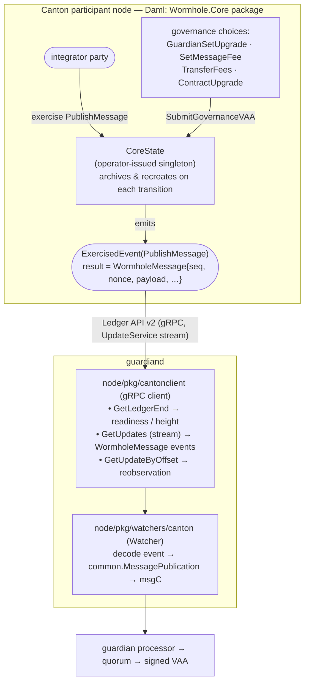

# Wormhole Core Bridge & Watcher for Canton

This directory contains the Wormhole **core bridge** for the
[Canton Network](https://www.canton.network/) (implemented in
[Daml](https://docs.daml.com/)) and documents the guardian-node **watcher** that
observes it (implemented in Go under
[`node/pkg/watchers/canton`](../node/pkg/watchers/canton) with a Ledger-API
client under [`node/pkg/cantonclient`](../node/pkg/cantonclient)).

**Target deployment:** the **public Canton Network mainnet** — Canton **3.5.x**
protocol, **Daml SDK 3.4.11**. This drives two design choices that differ from a
private/Canton-2.x deployment: Ledger API **v2**, and **no reliance on unique
contract keys** (unsupported on Canton 3.x — see §1, §4).

The goal is parity with the canonical EVM core bridge
([`ethereum/contracts/Implementation.sol`](../ethereum/contracts/Implementation.sol),
[`Messages.sol`](../ethereum/contracts/Messages.sol),
[`Governance.sol`](../ethereum/contracts/Governance.sol)) and conformance with
the Wormhole whitepapers:

- [0001 — Generic Message Passing](../whitepapers/0001_generic_message_passing.md)
- [0002 — Governance Messaging](../whitepapers/0002_governance_messaging.md)
- [0004 — Message Publishing](../whitepapers/0004_message_publishing.md)
- [node watcher README](../node/pkg/watchers/README.md)

> **Status:** initial implementation. The Daml package **compiles and tests pass
> at 100% template/choice coverage on Daml SDK 3.4.11**, including on-chain VAA
> verification validated against a real guardian-signed VAA. Remaining
> mainnet-gating items — the **Alpha** status of the `DA.Crypto.Text` builtins
> and the exact Ledger-API protobuf surface — are tracked in
> [Open Questions & Validation Items](#11-open-questions--validation-items).

---

## 1. Background: how Canton differs from EVM

Wormhole's core bridge has two responsibilities on every chain:

1. **Publish** messages — an on-chain caller emits a message; the guardians
   observe it, reach quorum, and produce a signed VAA.
2. **Verify** messages (VAAs) on-chain — needed so the chain can act on
   governance VAAs (guardian-set upgrades, fees, upgrades) and so higher-level
   protocols (token bridge, etc.) can verify inbound VAAs.

Canton is structurally unlike EVM/Solana/Sui, and those differences drive the
design:

| Concept | EVM | Canton |
| --- | --- | --- |
| Smart-contract model | Solidity contract with mutable storage | Daml **templates**; state is the set of **active contracts** (UTXO-like). State is changed by **archiving** a contract and **creating** its successor. |
| Calling a method | `CALL` to an address | **Exercising a choice** on a contract |
| Identity / "address" | 20-byte account/contract address | **Party ID** (a string `hint::fingerprint`) and **contract IDs** |
| Event log | `LOG`/`event` topics | Ledger-API **events** (`CreatedEvent`, `ExercisedEvent`) in the transaction stream |
| Block / height | block number | **participant offset** (monotone `int64`) into the update stream |
| Finality | probabilistic (reorgs) → consistency levels | deterministic: once a transaction is committed by the sequencer/mediator it is final. No reorgs. |
| Node API the watcher uses | JSON-RPC / `eth_getLogs` | **Ledger API v2** (gRPC), `UpdateService` streaming |
| Crypto available on-chain | `ecrecover`, `keccak256` precompiles | Daml `keccak256` and `secp256k1` builtins (see §5) |

The most consequential differences:

- **No `msg.sender`.** A Daml choice knows its acting parties, but Wormhole
  needs a stable 32-byte emitter address with a per-emitter monotonically
  increasing sequence. We solve this with an **`Emitter` registration**
  contract (§4.2), analogous to Sui's `EmitterCap`.
- **No `ecrecover`.** Daml's `secp256k1` builtin *verifies* a signature against
  a *public key*; it does not *recover* the signer from the signature like
  Ethereum does. Guardian-set state on Canton therefore stores guardian
  **public keys** (not just their 20-byte addresses), bound to the canonical
  addresses from the governance VAA (§5).
- **No global mutable singletons, and no unique contract keys.** The "core
  bridge contract" is modeled as a single long-lived **`CoreState`** contract,
  archived and recreated on every governance transition. Canton 3.x (the public
  Canton Network) **does not support unique contract keys** ([docs](https://docs.digitalasset.com/build/3.5/reference/daml/contract-keys.html)),
  so the singleton is **not** enforced by a key — it is enforced by the
  `operator` being the sole creator (single trusted issuer). See §4.1.

---

## 2. Architecture overview



The watcher is **read-only**: it never submits to Canton. It observes the
`PublishMessage` choice's result event, maps it to a
[`common.MessagePublication`](../node/pkg/common/chainlock.go), and hands it to
the processor exactly like every other watcher.

---

## 3. The VAA and the digest (unchanged across chains)

Canton uses the standard VAA v1 body and digest. Quoting
[0001](../whitepapers/0001_generic_message_passing.md) and matching
`Messages.sol`:

```
body = timestamp(4) ‖ nonce(4) ‖ emitterChain(2) ‖ emitterAddress(32)
       ‖ sequence(8) ‖ consistencyLevel(1) ‖ payload(var)

digest = keccak256( keccak256( body ) )          // double keccak, Ethereum-style
```

Guardians sign `digest` with secp256k1 (Ethereum ECDSA, 65-byte `r‖s‖v`).
Replay protection keys off `keccak256(body)` (the inner hash) exactly as
elsewhere in Wormhole. The on-chain Daml verifier reconstructs and re-hashes the
body and checks signatures against the stored guardian set (§5).

`ChainID` for Canton is **72** (`ChainIDCanton`), the next free mainnet ID after
Arc (71). It is registered in [`sdk/vaa/structs.go`](../sdk/vaa/structs.go).

---

## 4. On-chain design (Daml)

Daml package name: `wormhole-core` (the `core` package). Module layout under
[`core/daml/`](core/daml):

| Module | Responsibility |
| --- | --- |
| `Wormhole.Core.Bytes` | byte/hex helpers, big-endian integer (de)serialization |
| `Wormhole.Core.VAA` | VAA struct, parser, digest, signature/quorum verification |
| `Wormhole.Core.GuardianSet` | guardian-set representation and expiry |
| `Wormhole.Core.State` | the `CoreState` singleton template + `Emitter` registration |
| `Wormhole.Core.Governance` | governance packet parsing and the governance choices |
| `Wormhole.Core.Setup` | initialization (`setup`) |

### 4.1 `CoreState` — the singleton

```haskell
template CoreState
  with
    operator           : Party          -- holds/advances the singleton; the "deployer"
    chainId            : Int            -- 72
    governanceChainId  : Int            -- 1 (Solana)
    governanceContract : Bytes32        -- 0x..0004 (the governance emitter)
    guardianSetIndex   : Int            -- current set index
    guardianSets       : Map Int GuardianSet   -- index -> set (with expiry)
    messageFee         : Int            -- fee required to publish (native units)
    consumedGovernance : Set Bytes32    -- replay protection (keyed by digest)
  where
    signatory operator
    -- No contract key: Canton 3.x has no unique keys. Uniqueness is
    -- operator-enforced (single issuer); the current cid is tracked off-ledger.
```

Every state-mutating choice is `controller`-checked, archives the current
`CoreState`, and `create`s the next one with updated fields. This is the Daml
idiom for mutable state and gives us deterministic, replay-protected
transitions.

**Singleton without a key.** Canton 3.x doesn't support unique contract keys, so
"exactly one live `CoreState`" is guaranteed instead by the `operator` being its
**sole creator**: only the operator can `create` a `CoreState` (it is the
signatory), so its automation creates exactly one at setup and advances it
linearly by contract-id thereafter (each governance choice consumes the current
and returns the next cid). The watcher and integrators reference it by
contract-id, tracked from the ledger stream — never `fetchByKey`.

Per-emitter **sequence numbers are stored in each `Emitter`** (§4.2), not in
`CoreState`. This is deliberate: in Canton, a contract's choice can only be
exercised by a stakeholder of that contract, and the emitter owner is *not* a
stakeholder of the operator-owned `CoreState`. Keeping the sequence in the
`Emitter` (where the owner *is* a stakeholder) lets the owner publish — and
advance its own sequence — **without the operator's authority**, preserving
EVM's permissionless `publishMessage`. `CoreState` therefore holds only shared
config and governance state.

> **Why an `operator` party?** Canton requires every contract to have a
> signatory. The `operator` is a designated, well-known party (configured at
> deploy time) that owns the singleton. It has **no special authority** over
> message contents or governance outcomes — governance is gated entirely by VAA
> verification (§4.4). Its role is mechanical: it is the party that the daml
> transaction is submitted as in order to advance the singleton. This mirrors
> how non-EVM chains (e.g. Near) have an account that "owns" the bridge object
> without being able to forge messages.

### 4.2 Message publishing

Mirrors `publishMessage(nonce, payload, consistencyLevel)` from
`Implementation.sol:15` and whitepaper 0004.

An integrator first registers an emitter:

```haskell
template EmitterRequest with
    requester : Party
    operator  : Party
  where
    signatory requester
    observer operator
    -- operator exercises Approve, which (against CoreState) mints an Emitter

template Emitter
  with
    operator       : Party
    owner          : Party
    emitterAddress : Bytes32   -- assigned at approval; convention: keccak256(partyId(owner))
    sequence       : Int       -- next sequence to assign (per-emitter)
  where
    signatory operator
    observer owner
    -- No contract key (Canton 3.x); owner tracks the current cid off-ledger.
```

`emitterAddress` derivation: by convention **`keccak256(utf8(partyId(owner)))`**
(full 32 bytes), computed off-ledger and supplied to `ApproveEmitter`. We assign
it at registration rather than hashing on-ledger because Daml's `keccak256`
consumes hex-encoded bytes and there is no ergonomic UTF-8→hex of a party-id
string on-ledger.

**Address uniqueness is operator-enforced** (not key-enforced — Canton 3.x has
no unique keys): since the operator is the sole approver (`ApproveEmitter`), its
automation MUST check its active `Emitter` set and refuse a duplicate
`emitterAddress` before approving. Two emitters sharing an address would collide
sequences / spoof emitter identity, so this is a **security-relevant operator
invariant** (tracked in [Open Questions](#11-open-questions--validation-items)).
One emitter per party is sufficient for current integrators: each NTT deployment
uses its own admin party and therefore its own emitter
(see [§10](#10-integrating-higher-level-protocols-ntt-token-bridge)).

Publishing — a choice on the **`Emitter`** (controller = `owner`), so it needs
no operator authority:

```haskell
-- on Emitter
choice PublishMessage : WormholeMessage
  with
    nonce            : Int            -- uint32
    payload          : Bytes          -- <= 750 bytes (whitepaper 0004)
    consistencyLevel : Int            -- uint8; see §6
  controller owner
  do
    -- 1. assert payload length <= 750
    -- 2. (fee enforcement deferred; messageFee = 0 in v1)
    -- 3. archive self; create Emitter with sequence = sequence + 1
    -- 4. return WormholeMessage{sender = emitterAddress, sequence, nonce,
    --      payload, consistencyLevel}
    pure result
```

The choice's **exercise result** is the `WormholeMessage` (the sequence-bumped
`Emitter` is recreated as a side effect; the owner obtains its new contract-id
from the transaction's created events — tracked from the ledger stream — for the
next publish, since Canton 3.x has no contract key to look it up by).
The watcher reads the result directly from the `ExercisedEvent.exercise_result`
on the Ledger-API stream (see §7). The
`WormholeMessage` record is the wire contract between Daml and the watcher:

```haskell
data WormholeMessage = WormholeMessage with
    sender           : Bytes32   -- emitter address
    sequence         : Int       -- uint64
    nonce            : Int       -- uint32
    consistencyLevel : Int       -- uint8
    payload          : Bytes
  deriving (Eq, Show)
```

Equivalent to the EVM `LogMessagePublished(sender, sequence, nonce, payload,
consistencyLevel)` event (`Implementation.sol:12`). The VAA **timestamp** is not
carried in the record: per whitepaper 0001/0004 the guardian derives it from the
block, so the watcher reads it from the transaction's **ledger effective time**
(`Transaction.effective_at`) — see §7.1.

**Sequence numbers** are per-`emitterAddress`, start at 0, increment by 1 —
identical to EVM's `_state.sequences[emitter]`.

**Fees.** Whitepaper 0004 requires a fee in the chain's native token. Canton's
native unit is Canton Coin (CC), held as Daml contracts (Splice
`amulet`). For the initial implementation `messageFee` defaults to **0** and the
`feePayment` argument is a no-op placeholder; wiring real CC payment/`TransferFees`
is deferred (see Open Questions). The `SetMessageFee`/`TransferFees` governance
choices still update/move the accounting state so on-chain behavior matches the
governance protocol.

### 4.3 VAA verification choice

```haskell
-- on CoreState; pure verification, does not mutate state
nonconsuming choice ParseAndVerifyVAA : VerifiedVAA
  with
    encodedVAA : Bytes
    pubKeys    : [(Int, Bytes)]   -- guardianIndex -> 65-byte uncompressed pubkey
  controller operator
  do
    vaa <- parseVAA encodedVAA
    verifyVAA self vaa pubKeys     -- §5
    pure (toVerified vaa)
```

`pubKeys` are supplied by the caller because Daml verifies against a public key,
not by recovery (§5). They are *untrusted hints*; verification fails unless each
provided key hashes to the guardian address stored in the set.

### 4.4 Governance

Governance follows [0002](../whitepapers/0002_governance_messaging.md). A single
`SubmitGovernanceVAA` choice on `CoreState` (controller `operator`) verifies the
VAA and dispatches on the parsed action. Module identifier is **`"Core"`**
(`0x00..00436f7265`, 32 bytes). A governance VAA is accepted only if (matching
`Governance.sol:190`):

1. `verifyVAA` passes against the **current** guardian set;
2. `emitterChain == governanceChainId` and `emitterAddress == governanceContract`;
3. `module == "Core"` and `action` matches the choice;
4. `chain == chainId` (or `0` for chain-independent actions);
5. `digest ∉ consumedGovernance` — then it is inserted (replay protection).

Supported actions (parity with `GovernanceStructs.sol`):

| Action | ID | Payload (after 32-byte module + 1-byte action) | Behavior |
| --- | --- | --- | --- |
| **ContractUpgrade** | 1 | `chain(2) ‖ newContract(32)` | Records intent + emits an event. On Canton, "upgrade" = a [Daml package upgrade](https://docs.daml.com/upgrade/); `newContract` is interpreted as the new package-id (32 bytes). See note. |
| **GuardianSetUpgrade** | 2 | `chain(2) ‖ newIndex(4) ‖ len(1) ‖ keys(20·len)` | Validates `newIndex == current+1`; sets old set's `expirationTime = effectiveTime + 86400`; stores new set. Requires `pubKeys` hints to bind addresses (§5). |
| **SetMessageFee** | 3 | `chain(2) ‖ fee(32)` | Updates `messageFee`. |
| **TransferFees** | 4 | `chain(2) ‖ amount(32) ‖ recipient(32)` | Moves collected fees to `recipient`. (No-op accounting until CC payments are wired.) |

`RecoverChainId` (EVM action 5) is **EVM-specific** (it repairs `block.chainid`
after a fork) and has no analog on Canton; it is intentionally omitted.

**ContractUpgrade note:** EVM upgrades swap a proxy implementation. Daml has no
in-place code mutation; upgrading the bridge logic means deploying a new package
version and having the `operator` migrate the `CoreState` to the new package via
Daml's smart-contract upgrade (data-preserving). The governance VAA records the
authorized target package-id on-ledger; the operator's migration is then
gated by that recorded value. This is the faithful Canton analog and is the one
governance action whose mechanism differs most from EVM — see Open Questions.

### 4.5 Guardian-set expiry

Matches EVM (`Setters.sol`): when a new set is installed, the previous set's
`expirationTime` is set to `effectiveTime + 86400` (1 day). `verifyVAA` accepts a
non-current set only while `effectiveTime < expirationTime`. The current set
never expires.

---

## 5. On-chain signature verification (the crux)

EVM uses `ecrecover(digest, v, r, s)` and compares the recovered 20-byte address
to `guardianSet.keys[i]`. Daml's
[`DA.Crypto.Text`](https://docs.canton.network/appdev/reference/daml-standard-library/da-crypto-text)
has **no recovery** builtin; the relevant functions (confirmed against the
3.x docs) are:

```haskell
keccak256             : BytesHex -> BytesHex
secp256k1             : SignatureHex -> BytesHex -> PublicKeyHex -> Bool  -- SHA-256s the message first
secp256k1WithEcdsaOnly : SignatureHex -> BytesHex -> PublicKeyHex -> Bool  -- verifies the message directly
```

We use **`secp256k1WithEcdsaOnly`** because Ethereum signs the 32-byte
`keccak256(keccak256(body))` digest *directly* (no further hashing); plain
`secp256k1` would SHA-256 the digest first and never match. The design:

1. **Bind a caller-supplied pubkey → guardian address.** There is no recovery,
   so the verifier is given `pubKeys : [(Int, Bytes)]` (the signing guardians'
   uncompressed keys) and asserts `keccak256(pubKey)[12..32] == keys[index]`.
   Because the address is the keccak of the key, a wrong key can't pass — this
   re-introduces the EVM guarantee without recovery.

2. **DER-encode for the builtin.** `secp256k1WithEcdsaOnly` wants a **DER**
   signature and a **DER (SubjectPublicKeyInfo)** public key, both hex.
   `Wormhole.Core.VAA` DER-encodes the VAA's raw `(r, s)` (`derSignature`) and
   wraps the uncompressed point in the fixed secp256k1 SPKI prefix
   (`derPublicKey`). The 32-byte digest is passed as the message **as-is**.

3. **Verify.** `secp256k1WithEcdsaOnly (derSignature r s) digest (derPublicKey pubKey)`.

4. **Quorum** — identical to EVM `Messages.sol:90`:
   `required = floor(numGuardians * 2 / 3) + 1`. Signatures must be in
   **strictly ascending** guardian-index order (prevents double-counting).

### Making verification hint-free for integrators (recommended)

Supplying `pubKeys` on every call is acceptable for governance (rare,
operator-submitted) but is real friction for integrators like NTT, whose
relayers would otherwise have to look up the signing guardians' keys on every
inbound message. The recommended evolution: **persist the guardian public keys
in the guardian set** — i.e. `GuardianSet` stores `pubKeys` alongside `keys`,
bound to the canonical addresses *once* at install time (the
GuardianSetUpgrade / setup choices already receive pubkey hints and verify
`keccak256(pubKey)[12..32] == addr`, so the binding is free). After that,
`verifyVAA` reads the keys from the set and callers pass **only the VAA bytes**,
making the integrator API equivalent to EVM's `parseAndVerifyVM(bytes)`. See
[§10](#10-integrating-higher-level-protocols-ntt-token-bridge). This is a
planned change to the current code, which still takes per-call hints.

### Validation status

The whole verification path is **empirically validated** against a real
Ethereum-style guardian signature on Daml SDK 3.4.11. `testParseAndVerifyVAA` and
`testGovernanceSetMessageFee` (in [`TestCore.daml`](test/daml/Test/TestCore.daml))
feed a genuine VAA — signed by the well-known devnet guardian and produced by
[`node/pkg/cantonclient/vectorgen_test.go`](../node/pkg/cantonclient/vectorgen_test.go)
— through `ParseAndVerifyVAA` / `SubmitGovernanceVAA` and both pass. That confirms:

- ✅ `keccak256` hashes the **decoded** hex bytes (the double-keccak digest
  matched the signature), so the `BytesHex` semantics are as assumed;
- ✅ `derSignature` (DER `r,s`) and `derPublicKey` (SPKI) are encoded correctly;
- ✅ `secp256k1WithEcdsaOnly` verifies the 32-byte digest **directly** (no
  pre-hash), and the pubkey→address keccak binding holds.

One caveat remains, and it is about *stability*, not correctness:

- **⚠️ Alpha feature.** `DA.Crypto.Text` is **Early Access / Alpha** in the
  Daml 3.4 line ("can change without notice"); the build uses
  `-Wno-crypto-text-is-alpha`. Depending on an Alpha builtin for on-chain
  governance is a **mainnet-readiness risk** — confirm its GA timeline before
  production. All Daml crypto is encapsulated in `Wormhole.Core.VAA`, so if the
  builtin's contract changes, only that module is affected.

---

## 6. Consistency / finality

Canton transactions are final once committed by the synchronizer
(sequencer + mediator); there are no reorgs. Like Sui, Canton therefore has a
single meaningful consistency level. The watcher treats every observed message
as final and publishes immediately. The `consistencyLevel` byte is passed
through from the `WormholeMessage` (integrators may set it; per
[0001](../whitepapers/0001_generic_message_passing.md) "all other chains … this
field will be `0`"), and the watcher does **not** gate on it.

---

## 7. Off-chain design (the watcher)

Lives in [`node/pkg/watchers/canton`](../node/pkg/watchers/canton); the gRPC
client is [`node/pkg/cantonclient`](../node/pkg/cantonclient). It mirrors the
structure of the Sui watcher
([`node/pkg/watchers/sui`](../node/pkg/watchers/sui)) and the `suiclient`
package.

### 7.1 `cantonclient` (Ledger API v2, gRPC)

There is no official Go binding for the Daml Ledger API, so the
`com.daml.ledger.api.v2` protobufs (the State + Update service closure, from
**Canton 3.5.5**) are vendored under
[`node/pkg/cantonclient/proto`](../node/pkg/cantonclient/proto) and compiled with
the repo's `buf` toolchain; the generated stubs are committed and CI-verified
(see [`node/pkg/cantonclient/README.md`](../node/pkg/cantonclient/README.md)).
The client exposes a small interface (mirroring `suiclient.SuiClient`):

```go
type CantonClient interface {
    // GetLedgerEnd returns the current participant offset (the "height").
    GetLedgerEnd(ctx context.Context) (int64, error)

    // SubscribeUpdates streams transactions from beginExclusive onward,
    // delivering each Wormhole message-publish event found in them.
    SubscribeUpdates(ctx context.Context, beginExclusive int64, templateID TemplateID, choiceName string, out chan<- CantonMessageEvent) (Subscription, error)

    // GetUpdateByOffset fetches a single transaction by offset (reobservation).
    GetUpdateByOffset(ctx context.Context, offset int64) (CantonTransaction, error)

    Close() error
}
```

Mapping to Ledger API v2 RPCs:

| Need | Ledger API v2 |
| --- | --- |
| height / readiness | `StateService.GetLedgerEnd` → `offset (int64)` |
| live message stream | `UpdateService.GetUpdates` (server stream); filter `Transaction.events[].exercised` by `template_id` + `choice == "PublishMessage"` |
| reobservation | `UpdateService.GetUpdateByOffset` (or `GetTransactionByOffset`) for the offset encoded in the reobservation request |

The Wormhole message comes from the **`ExercisedEvent`** of the `PublishMessage`
choice: `exercise_result` is the `WormholeMessage` record (§4.2), decoded from
the Ledger-API `Value`/`Record` representation.

**Party filter.** The `GetUpdates` request uses an `UpdateFormat` with a wildcard
template filter under **`filters_for_any_party`** by default — the watcher
observes `PublishMessage` from *every* emitter on the participant and needs no
operator party id. (An optional `--cantonReadAsParty` narrows the stream to a
single party via `filters_by_party` instead.) `TRANSACTION_SHAPE_LEDGER_EFFECTS`
is required so `ExercisedEvent`s — which carry the choice result — are included.

### 7.2 `TxID` and offsets

The Ledger API has no 32-byte transaction hash. We use the **participant offset**
(`int64`) as the canonical transaction identifier:

- `MessagePublication.TxID` = the transaction's offset, big-endian, left-padded
  to 32 bytes (so it round-trips through the 32-byte `tx_hash` reobservation
  field).
- Reobservation decodes those 32 bytes back to an `int64` offset and calls
  `GetUpdateByOffset`.

The Daml `update_id` (a string) is carried in logs for human correlation but is
not the `TxID`, because reobservation plumbing (`gossipv1.ObservationRequest`)
uses raw bytes and offsets are the stable, range-queryable key.

### 7.3 `Run` loop (three goroutines, mirrors Sui)


Each observed event becomes a `common.MessagePublication`
([`chainlock.go`](../node/pkg/common/chainlock.go)) with
`EmitterChain = vaa.ChainIDCanton`, `EmitterAddress = vaa.Address(msg.sender)`,
`Unreliable = false`, then is sent on `msgC`.

### 7.4 Configuration

`WatcherConfig` (implements `watchers.WatcherConfig`):

```go
type WatcherConfig struct {
    NetworkID  watchers.NetworkID
    ChainID    vaa.ChainID        // ChainIDCanton
    Rpc        string             // host:port of the Ledger API
    PackageID  string             // package-id of wormhole-core (template filter)
}
```

Wired into the guardian via
[`node/pkg/node/options.go`](../node/pkg/node/options.go) and a `--cantonRPC` /
`--cantonContract` flag pair in `node/cmd/guardiand`, following the Sui pattern.

---

## 8. File map

```
canton/
  README.md                      ← this document
  multi-package.yaml             ← multi-package project (core + test)
  Dockerfile                     ← devnet image (build DARs + run sandbox)
  core/                          ← `wormhole-core` package (templates; NO daml-script)
    daml.yaml
    daml/Wormhole/Core/Bytes.daml
    daml/Wormhole/Core/VAA.daml
    daml/Wormhole/Core/GuardianSet.daml
    daml/Wormhole/Core/State.daml
    daml/Wormhole/Core/Governance.daml
    daml/Wormhole/Core/Setup.daml
  test/                          ← `wormhole-core-test` package (Daml Scripts)
    daml.yaml                    ← data-dependency on core's DAR
    daml/Test/TestCore.daml      ← unit tests + devnet `setup` / `integrationPublish`
  devnet/
    start_sandbox.sh             ← starts the Ledger API v2 sandbox
    bootstrap.sh                 ← allocates Operator + creates CoreState
    wait_for_ledger.sh

node/pkg/cantonclient/           ← Ledger API v2 gRPC client
  proto/com/daml/ledger/api/v2/  ← real vendored protos (Canton 3.5.5)
  proto/gen/                     ← generated Go stubs (buf generate)
  vectorgen_test.go              ← regenerates the signed-VAA test vector (GEN_CANTON_VECTORS=1)
node/pkg/watchers/canton/        ← the watcher (config.go, watcher.go)
  watcher_integration_test.go    ← dpm-driven end-to-end test (integration tag)
sdk/vaa/structs.go               ← ChainIDCanton = 72
devnet/canton-devnet.yaml        ← Tilt k8s manifest (sandbox + bootstrap)
Tiltfile                         ← `canton` component (opt-in)
```

## 9. Local development

This project uses the Canton Network
[`dpm`](https://docs.canton.network/sdks-tools/cli-tools/dpm) toolchain (not the
legacy `daml` assistant). It is a **multi-package** project
([`multi-package.yaml`](multi-package.yaml)): `core` (the production
`wormhole-core` templates — no `daml-script`) and `test` (`wormhole-core-test`,
the Daml Scripts, with a data-dependency on core's DAR). Splitting keeps
`daml-script` and the test code out of the production DAR.

### Building & testing with `dpm`

```bash
# one-time: install the dpm CLI
curl https://get.digitalasset.com/install/install.sh | sh

cd canton
dpm install 3.4.11               # fetch the pinned SDK
dpm build --all                  # → core/.daml/dist/wormhole-core-0.1.0.dar
                                 #   test/.daml/dist/wormhole-core-test-0.1.0.dar
cd test && dpm test --all --show-coverage   # run the Scripts + coverage
```

`dpm test` runs every `Script` in
[`test/daml/Test/TestCore.daml`](test/daml/Test/TestCore.daml) on an in-memory
ledger — no running sandbox required. The suite passes, exercising **100% of the
core templates and choices** (3/3 templates, 7/7 choices — reported as
*external* coverage, since the templates live in the `core` data-dependency),
including governance and VAA verification with a **real guardian-signed VAA**
test vector (§5). Note Daml coverage is **template/choice coverage only**; the
pure parser / DER / governance helpers are additionally validated by Script
*assertions* and the signed-VAA vector, not by the coverage metric.

### Watcher integration test (dpm + Go)

The watcher's real transport is covered end-to-end by a Go integration test,
[`node/pkg/watchers/canton/watcher_integration_test.go`](../node/pkg/watchers/canton/watcher_integration_test.go)
(`//go:build integration`):

```
go test -tags integration -run TestCantonWatcherIntegration ./pkg/watchers/canton -v
```

It builds the DAR, boots a `dpm sandbox`, publishes a message via
`dpm script --upload-dar`, then connects the **real** `cantonclient` gRPC client
(real Ledger API v2 protos) and asserts the published `WormholeMessage` is
observed and mapped to a `common.MessagePublication`. It is skipped unless `dpm`
(+ a JDK) is present and is excluded from the default build. Notes learned the
hard way and baked into the test/devnet scripts: Canton's `sandbox` binds the
Ledger API on **6865** and does not take `--dar`/`--port`; and `dpm script` needs
**`--upload-dar`** so package vetting is synchronous (a bare upload races vetting
→ `PACKAGE_SELECTION_FAILED`).

### End-to-end with Tilt

Canton is wired into [`Tiltfile`](../Tiltfile) as an **opt-in** component
(`--canton`), mirroring the Sui setup:

```
tilt up -- --canton
```

This brings up:

- a **`canton`** pod running a Canton **sandbox** (Ledger API v2 on `:6865`)
  ([`devnet/start_sandbox.sh`](devnet/start_sandbox.sh));
- a **`canton-contracts`** bootstrap step that uploads+vets the `wormhole-core`
  DAR (`dpm script --upload-dar`), allocates the **Operator** party, and creates
  the `CoreState` with the standard devnet guardian via `Test.TestCore:setup`
  ([`devnet/bootstrap.sh`](devnet/bootstrap.sh)); and
- the **guardian** configured with `--cantonRPC canton:6865` (no
  `--cantonReadAsParty`: the watcher uses a wildcard "any party" filter, §7.1).

### Status: opt-in while the k8s devnet path is validated

Unlike Sui, the `canton` component is **not** enabled by `--ci`. The guardian
builds the real client by default (no build tag) and the watcher needs no
operator party id (wildcard filter), so there are no functional gates left — only
two things to finish/validate:

1. **Full k8s path validation.** Validated locally: the Go integration test (§9)
   covers the watcher↔ledger path; the sandbox `0.0.0.0` bind
   (`-C canton.participants.sandbox.ledger-api.address=0.0.0.0` → binds `*:6865`),
   the bootstrap `dpm script --upload-dar` flow, and the same-pod localhost wiring
   are all confirmed against a live `dpm sandbox`. What still needs a real cluster
   run: the `canton-node` **image build** (`canton/Dockerfile`, which fetches dpm
   and builds the DAR) and the **guardian connecting** to `canton:6865` across the
   k8s Service.
2. **Daml crypto is Alpha.** On-chain VAA verification works (validated against a
   real guardian VAA, §5) but depends on the **Alpha** `DA.Crypto.Text` builtins
   — a GA-stability risk, not a correctness one, and not a devnet blocker
   (Open Question #1).

Today `--canton` stands up the **chain + contracts** for Daml-side development
(iterating on the templates, `dpm test`); the watcher↔ledger path itself is
covered by the integration test in §9.

---

## 10. Integrating higher-level protocols (NTT, token bridge)

Higher-level protocols don't change the core bridge; they use it as two
primitives — **publish** (emit a message) and **verify** (check an inbound VAA).
[NTT](https://github.com/wormhole-foundation/native-token-transfers) is the
representative case: its on-chain shape is a **Manager** plus one or more
**Transceivers**, and the `WormholeTransceiver` is the piece that touches this
bridge. The core-bridge **emitter is the Wormhole transceiver**; peers on other
chains are configured by `(chainId, emitterAddress)`.

### Emitter / send path

Each NTT deployment runs under its **own admin party** and registers its **own
`Emitter`**, so one-emitter-per-party is sufficient — no salt needed. The
transceiver publishes by exercising `PublishMessage` on its `Emitter`
(`controller owner`), so **sends need no operator authority**, and the
transceiver's stable `emitterAddress` is exactly what other chains register as
the peer.

### Verify / receive path

A receiving transceiver verifies an inbound VAA, then the manager mints/releases.
The recommended, lowest-friction integrator API:

1. **Hint-free pure verification.** With guardian pubkeys persisted in the set
   ([§5](#5-on-chain-signature-verification-the-crux)), `verifyVAA` is a pure
   function taking only `(guardianSet, vaaBytes)` — integrators `import` it: no
   operator interaction, no pubkey hints.
2. **Read access to the guardian set** via Canton **explicit disclosure**: the
   operator publishes the active guardian-set contract and shares its disclosure
   blob through a small read endpoint; the relayer attaches it as a
   `DisclosedContract`. (Alternative: a public-observer guardian-set snapshot so
   the relayer submits a bare command — only worthwhile if the deployment already
   has a shared "public" party.)
3. **Integrators own replay/dedup.** The NTT manager tracks consumed inbound
   digests itself; `CoreState.consumedGovernance` stays reserved for `"Core"`
   governance — exactly as the EVM token bridge keeps its own
   `isTransferCompleted`.

Sketch of the transceiver's receive choice:

```haskell
-- controller = transceiver owner; gs comes from a disclosed guardian-set contract
choice Receive : ()
  with vaaBytes : Bytes
  controller owner
  do
    gs <- fetch guardianSetCid                              -- disclosed; the set the VAA names
    let v = Wormhole.Core.VAA.parseAndVerify gs vaaBytes    -- pure; aborts if invalid
    assertMsg "unknown peer" (isConfiguredPeer v.emitterChain v.emitterAddress)
    -- manager: dedup v.hash, decode NativeTokenTransfer, mint/release
    ...
```

Off-chain the relayer submits a single `exercise Receive {vaaBytes}` command plus
the one disclosed guardian-set contract — no pubkey computation. This is the
Canton equivalent of EVM's `parseAndVerifyVM(bytes)`.

### Design additions this implies

- Persist guardian **pubkeys** in `GuardianSet` so verification is hint-free
  ([§5](#5-on-chain-signature-verification-the-crux)).
- Add a **readable/disclosable guardian-set contract** and document the
  explicit-disclosure flow.
- Export `Wormhole.Core.VAA.parseAndVerify` as the integrator-facing API.

These are tracked in [Open Questions](#11-open-questions--validation-items).

---

## 11. Open Questions & Validation Items

1. **Daml crypto.** The verification path is now **validated end-to-end** against
   a real guardian-signed VAA on Daml 3.4.11 (`secp256k1WithEcdsaOnly` + DER
   sig/SPKI key + double-keccak digest; §5, `testParseAndVerifyVAA`). The only
   remaining concern is that `DA.Crypto.Text` is **Alpha**
   (`-Wno-crypto-text-is-alpha`) — confirm its GA timeline before mainnet. All
   isolated in `Wormhole.Core.VAA`.
2. **Ledger API v2 RPC surface.** The exact message/field names of
   `UpdateService.GetUpdates` / `GetUpdateByOffset` / `StateService.GetLedgerEnd`
   shift slightly across Canton releases (e.g. `begin_exclusive`/`end_inclusive`,
   `Update` oneof members). The vendored proto subset targets a specific release
   — confirm and pin against Daml SDK 3.4.11 / Canton 3.5.x.
3. **Operator-enforced uniqueness (Canton 3.x has no unique keys).** The
   `CoreState` singleton and `Emitter` address-uniqueness are guaranteed by the
   operator being the sole issuer, not by contract keys (§4.1, §4.2). Confirm the
   operator automation: (a) creates exactly one `CoreState` and advances it by
   cid; (b) refuses a duplicate `emitterAddress` in `ApproveEmitter`. These are
   security-relevant invariants now that the ledger no longer enforces them.
4. **Integrator VAA verification.** Implement the hint-free guardian set (persist
   pubkeys, §5) and confirm the guardian-set distribution mechanism for
   integrators (explicit disclosure vs public-observer snapshot). See
   [§10](#10-integrating-higher-level-protocols-ntt-token-bridge).
5. **Native fees.** Whether/when to wire real Canton Coin (Splice `amulet`)
   payments into `PublishMessage`/`TransferFees`, or whether Canton runs fee-less
   initially (`messageFee = 0`).
6. **ContractUpgrade mechanism.** Confirm the operator-driven Daml package
   upgrade flow and how strictly the recorded target package-id should gate it.
7. **Governance emitter.** Uses the standard governance emitter (Solana, chain 1,
   address `0x00..04`). Confirm for the target deployment/network.

